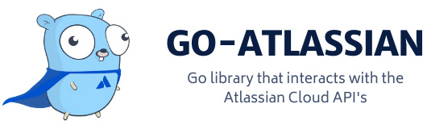

# 📑 Introduction




&#x20;[](https://github.com/ctreminiom/go-atlassian/releases/latest) [](https://pkg.go.dev/github.com/ctreminiom/go-atlassian) [](https://goreportcard.com/report/github.com/ctreminiom/go-atlassian) [](https://app.fossa.com/projects/git%2Bgithub.com%2Fctreminiom%2Fgo-atlassian?ref=badge\_shield) [](https://codecov.io/gh/ctreminiom/go-atlassian) [](https://www.codacy.com/gh/ctreminiom/go-atlassian/dashboard?utm\_source=github.com\&utm\_medium=referral\&utm\_content=ctreminiom/go-atlassian\&utm\_campaign=Badge\_Grade) [](https://github.com/ctreminiom/go-atlassian/blob/master/LICENSE) [](https://github.com/ctreminiom/go-atlassian/actions?query=workflow%3ATesting) [](https://docs.go-atlassian.io/) [](https://bestpractices.coreinfrastructure.org/projects/4861) [](https://discord.gg/yqaQFYHS)


Communicate with the [Atlassian API's](https://developer.atlassian.com/cloud/) quickly and easily with the **go-atlassian** module. With the **go-atlassian** client, you can retrieve and manipulate the extensive Atlassian Cloud API's like Jira, Confluence, Jira Agile, Jira Service Management, Atlassian Admin and much more!.

If you find an endpoint not supported, please submit a pull request or raise a feature issue - it's always greatly appreciated.

### Installation

If you do not have [Go](https://golang.org/) installed yet, you can find installation instructions [here](https://golang.org/doc/install). Please note that the package requires Go version 1.13 or later for module support.

To pull the most recent version of **go-atlassian**, use `go get`.

```
go get github.com/ctreminiom/go-atlassian
```

Then import the package into your project as you normally would. You can import the following packages

| Package     | import path                                     |
| ----------- | ----------------------------------------------- |
| Jira v2     | `github.com/ctreminiom/go-atlassian/jira/v2`    |
| Jira v3     | `github.com/ctreminiom/go-atlassian/jira/v3`    |
| Jira Agile  | `github.com/ctreminiom/go-atlassian/jira/agile` |
| Jira ITSM   | `github.com/ctreminiom/go-atlassian/jira/sm`    |
| Confluence  | `github.com/ctreminiom/go-atlassian/confluence` |
| Cloud Admin | `github.com/ctreminiom/go-atlassian/admin`      |

Now you're ready to Go.

## 🧳 Creating A Client

Before using the **go-atlassian** package, you need to have an Atlassian API key. If you do not have a key yet, you can sign up [here](https://support.atlassian.com/atlassian-account/docs/manage-api-tokens-for-your-atlassian-account/).

Create a client with your instance host and access token to start communicating with the Atlassian API's.

```
instance, err := confluence.New(nil, "INSTANCE_HOST")
if err != nil {
    log.Fatal(err)
}

instance.Auth.SetBasicAuth("YOUR_CLIENT_MAIL", "YOUR_APP_ACCESS_TOKEN")
```

If you need to use a preconfigured HTTP client, simply pass its address to the `New` function.

```go
transport := http.Transport{
	Proxy: http.ProxyFromEnvironment,
	Dial: (&net.Dialer{
		// Modify the time to wait for a connection to establish
		Timeout:   1 * time.Second,
		KeepAlive: 30 * time.Second,
	}).Dial,
	TLSHandshakeTimeout: 10 * time.Second,
}

client := http.Client{
	Transport: &transport,
	Timeout:   4 * time.Second,
}

instance, err := confluence.New(&client, "INSTANCE_HOST")
if err != nil {
	log.Fatal(err)
}

instance.Auth.SetBasicAuth("YOUR_CLIENT_MAIL", "YOUR_APP_ACCESS_TOKEN")
```

## 🗺️ Services

The client contains a distinct service for working with each of the Atlassian API's endpoints. Each service has a set of service functions that make specific API calls to their respective endpoint.

To start communicating with the **go-atlassian**, choose a service and call its service function. Take the Jira service for example.

To get the issue with the transitions, use the **Issue** service function.

```go
ctx := context.Background()
issueKey := "KP-2"
expand := []string{"transitions"}

issue, response, err := atlassian.Issue.Get(ctx,issueKey, nil, expand)
if err != nil {
	log.Fatal(err)
}

log.Println(issue.Key)

for _, transition := range issue.Transitions {
	log.Println(transition.Name, transition.ID, transition.To.ID, transition.HasScreen)
}
```

To search issues using a JQL query, use the **Issue.Search** service function.

```go
var (
	jql    = "order by created DESC"
	fields = []string{"status"}
	expand = []string{"changelog", "renderedFields", "names", "schema", "transitions", "operations", "editmeta"}
)

issues, response, err := atlassian.Issue.Search.Post(context.Background(), jql, fields, expand, 0, 50, "")
if err != nil {
	log.Fatal(err)
}

log.Println("HTTP Endpoint Used", response.Endpoint)
log.Println(issues.Total)
```

The rest of the service functions work much the same way; they are concise and behave as you would expect. The [documentation](https://docs.go-atlassian.io/) contains several examples on how to use each service function.

## ✍️ Contributions

If you would like to contribute to this project, please adhere to the following guidelines.

* Submit an issue describing the problem.
* Fork the repo and add your contribution.
* Add appropriate tests.
* Run go fmt, go vet, and golint.
* Prefer idiomatic Go over non-idiomatic code.
* Follow the basic Go conventions found [here](https://github.com/golang/go/wiki/CodeReviewComments).
* If in doubt, try to match your code to the current codebase.
* Create a pull request with a description of your changes.

Again, contributions are greatly appreciated!

## 💡 Inspiration

The project was created with the purpose to provide a unique point to provide an interface for interacting with Atlassian products. This module is highly inspired by the Go library [https://github.com/andygrunwald/go-jira](https://github.com/andygrunwald/go-jira) but focused on Cloud solutions.

## 📝 License

Copyright © 2021 [Carlos Treminio](https://github.com/ctreminiom). This project is [MIT](https://opensource.org/licenses/MIT) licensed.

[](https://app.fossa.com/projects/git%2Bgithub.com%2Fctreminiom%2Fgo-atlassian?ref=badge\_large)

## 🤝 Special Thanks

In addition to all the contributors we would like to thanks to these companies:

* [Atlassian](https://www.atlassian.com/) for providing us Atlassian Admin/Jira/Confluence Standard licenses.
* [JetBrains](https://www.jetbrains.com/) for providing us with free licenses of [GoLand](https://www.jetbrains.com/pycharm/)
* [GitBook](https://www.gitbook.com/) for providing us non-profit / open-source plan so hence I would like to express my thanks here.
