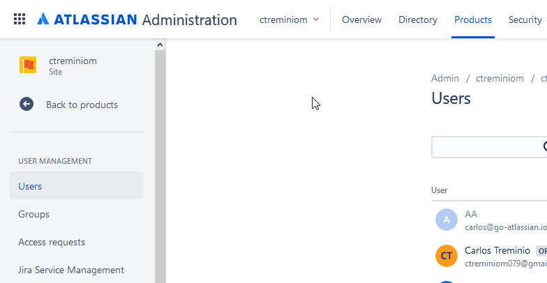

# 🗃️ Organization

The [organizations REST API](https://developer.atlassian.com/cloud/admin/organization/rest/intro/) lets you get information about your organizations, including:

* A list of organizations
* Information about an organization
* Users or domains associated with an organization
* An [audit log](https://confluence.atlassian.com/x/Ul-aOQ) of events from an organization



## Get organizations

Returns a list of your organizations \(based on your API key\).

```go
package main

import (
	"context"
	"fmt"
	"github.com/ctreminiom/go-atlassian/admin"
	"log"
	"os"
)

func main() {

	//ATLASSIAN_ADMIN_TOKEN
	var apiKey = os.Getenv("ATLASSIAN_ADMIN_TOKEN")

	cloudAdmin, err := admin.New(nil)
	if err != nil {
		log.Fatal(err)
	}

	cloudAdmin.Auth.SetBearerToken(apiKey)
	cloudAdmin.Auth.SetUserAgent("curl/7.54.0")

	organizations, response, err := cloudAdmin.Organization.Gets(context.Background(), "")
	if err != nil {
		if response != nil {
			log.Println("Response HTTP Response", string(response.BodyAsBytes))
		}
		log.Fatal(err)
	}

	log.Println("Response HTTP Code", response.StatusCode)
	log.Println("HTTP Endpoint Used", response.Endpoint)

	fmt.Println(string(response.BodyAsBytes))

	log.Println(organizations.Links)
	for _, organization := range organizations.Data {
		log.Println(organization.ID, organization.Attributes.Name)
	}
}

```


🧚‍♀️ **Tips:** You can extract the following struct tags


```go
type OrganizationPageScheme struct {
	 Data  []*OrganizationModelScheme       `json:"data,omitempty"`
	 Links *OrganizationLinkPageModelScheme `json:"links,omitempty"`
}

type OrganizationLinkPageModelScheme struct {
	 Self string `json:"self,omitempty"`
	 Prev string `json:"prev,omitempty"`
	 Next string `json:"next,omitempty"`
}

type OrganizationModelScheme struct {
	 ID            string                           `json:"id,omitempty"`
	 Type          string                           `json:"type,omitempty"`
	 Attributes    *OrganizationModelAttribute      `json:"attributes,omitempty"`
	 Relationships *OrganizationModelRelationships  `json:"relationships,omitempty"`
	 Links         *OrganizationLinkSelfModelScheme `json:"links,omitempty"`
}

type OrganizationModelAttribute struct {
	 Name string `json:"name,omitempty"`
}

type OrganizationModelRelationships struct {
	 Domains *OrganizationModelSchemes `json:"domains,omitempty"`
	 Users   *OrganizationModelSchemes `json:"users,omitempty"`
}

type OrganizationModelSchemes struct {
	 Links struct {
		 Related string `json:"related,omitempty"`
	 } `json:"links,omitempty"`
}

type OrganizationLinkSelfModelScheme struct {
	 Self string `json:"self,omitempty"`
}
```

## Get an organization by ID

Returns information about a single organization by ID

```go
package main

import (
	"context"
	"github.com/ctreminiom/go-atlassian/admin"
	"log"
	"os"
)

func main() {

	//ATLASSIAN_ADMIN_TOKEN
	var apiKey = os.Getenv("ATLASSIAN_ADMIN_TOKEN")

	cloudAdmin, err := admin.New(nil)
	if err != nil {
		log.Fatal(err)
	}

	cloudAdmin.Auth.SetBearerToken(apiKey)
	cloudAdmin.Auth.SetUserAgent("curl/7.54.0")

	var organizationID = "9a1jj823-jac8-123d-jj01-63315k059cb2"

	organization, response, err := cloudAdmin.Organization.Get(context.Background(), organizationID)
	if err != nil {
		if response != nil {
			log.Println("Response HTTP Response", string(response.BodyAsBytes))
		}
		log.Fatal(err)
	}

	log.Println("Response HTTP Code", response.StatusCode)
	log.Println("HTTP Endpoint Used", response.Endpoint)
	log.Println(organization.Data.ID)
}

```


🧚‍♀️ **Tips:** You can extract the following struct tags


```go
type OrganizationScheme struct {
   Data *OrganizationModelScheme `json:"data,omitempty"`
}
```

## Get users in an organization

Returns a list of users in an organization.

```go
package main

import (
	"context"
	"github.com/ctreminiom/go-atlassian/admin"
	"log"
	"net/url"
	"os"
)

func main() {

	//ATLASSIAN_ADMIN_TOKEN
	var apiKey = os.Getenv("ATLASSIAN_ADMIN_TOKEN")

	cloudAdmin, err := admin.New(nil)
	if err != nil {
		log.Fatal(err)
	}

	cloudAdmin.Auth.SetBearerToken(apiKey)
	cloudAdmin.Auth.SetUserAgent("curl/7.54.0")

	var (
		organizationID = "9a1jj823-jac8-123d-jj01-63315k059cb2"
		cursor         string
		userChunks     []*admin.OrganizationUserPageScheme
	)

	for {

		users, response, err := cloudAdmin.Organization.Users(context.Background(), organizationID, cursor)
		if err != nil {
			if response != nil {
				log.Println("Response HTTP Response", string(response.BodyAsBytes))
			}
			log.Fatal(err)
		}

		log.Println("Response HTTP Code", response.StatusCode)
		log.Println("HTTP Endpoint Used", response.Endpoint)

		userChunks = append(userChunks, users)

		if len(users.Links.Next) == 0 {
			break
		}

		//extract the next cursor pagination
		nextAsURL, err := url.Parse(users.Links.Next)
		if err != nil {
			log.Fatal(err)
		}

		cursor = nextAsURL.Query().Get("cursor")
	}

	for _, chunk := range userChunks {

		for _, user := range chunk.Data {
			log.Println(user.Email, user.Name)
		}

	}

}

```


🧚‍♀️ **Tips:** You can extract the following struct tags


```go
type OrganizationUserPageScheme struct {
	Data  []*OrganizationUserScheme `json:"data,omitempty"`
	Links *LinkPageModelScheme      `json:"links,omitempty"`
	Meta  struct {
		Total int `json:"total,omitempty"`
	} `json:"meta,omitempty"`
}

type OrganizationUserScheme struct {
	AccountID      string                           `json:"account_id,omitempty"`
	AccountType    string                           `json:"account_type,omitempty"`
	AccountStatus  string                           `json:"account_status,omitempty"`
	Name           string                           `json:"name,omitempty"`
	Picture        string                           `json:"picture,omitempty"`
	Email          string                           `json:"email,omitempty"`
	AccessBillable bool                             `json:"access_billable,omitempty"`
	LastActive     string                           `json:"last_active,omitempty"`
	ProductAccess  []*OrganizationUserProductScheme `json:"product_access,omitempty"`
	Links          *LinkSelfModelScheme             `json:"links,omitempty"`
}

type OrganizationUserProductScheme struct {
	Key        string `json:"key,omitempty"`
	Name       string `json:"name,omitempty"`
	URL        string `json:"url,omitempty"`
	LastActive string `json:"last_active,omitempty"`
}
```

## Get domains in an organization

Returns a list of domains in an organization one page at a time.

```go
package main

import (
	"context"
	"github.com/ctreminiom/go-atlassian/admin"
	"log"
	"net/url"
	"os"
)

func main() {

	//ATLASSIAN_ADMIN_TOKEN
	var apiKey = os.Getenv("ATLASSIAN_ADMIN_TOKEN")

	cloudAdmin, err := admin.New(nil)
	if err != nil {
		log.Fatal(err)
	}

	cloudAdmin.Auth.SetBearerToken(apiKey)
	cloudAdmin.Auth.SetUserAgent("curl/7.54.0")

	var (
		organizationID = "9a1jj823-jac8-123d-jj01-63315k059cb2"
		cursor         string
		domainChunks   []*admin.OrganizationDomainPageScheme
	)

	for {

		domains, response, err := cloudAdmin.Organization.Domains(context.Background(), organizationID, cursor)
		if err != nil {
			if response != nil {
				log.Println("Response HTTP Response", string(response.BodyAsBytes))
			}
			log.Fatal(err)
		}

		log.Println("Response HTTP Code", response.StatusCode)
		log.Println("HTTP Endpoint Used", response.Endpoint)
		domainChunks = append(domainChunks, domains)

		if len(domains.Links.Next) == 0 {
			break
		}

		//extract the next cursor pagination
		nextAsURL, err := url.Parse(domains.Links.Next)
		if err != nil {
			log.Fatal(err)
		}

		cursor = nextAsURL.Query().Get("cursor")
	}

	for _, chunk := range domainChunks {

		for _, domain := range chunk.Data {
			log.Println(domain.ID, domain.Attributes.Name, domain.Attributes.Claim.Status)
		}

	}

}

```


🧚‍♀️ **Tips:** You can extract the following struct tags


```go
type OrganizationDomainPageScheme struct {
	Data  []*OrganizationDomainModelScheme `json:"data,omitempty"`
	Links *LinkPageModelScheme             `json:"links,omitempty"`
}

type OrganizationDomainModelScheme struct {
	ID         string `json:"id,omitempty"`
	Type       string `json:"type,omitempty"`
	Attributes struct {
		Name  string `json:"name,omitempty"`
		Claim struct {
			Type   string `json:"type,omitempty"`
			Status string `json:"status,omitempty"`
		} `json:"claim,omitempty"`
	} `json:"attributes,omitempty"`
	Links *LinkSelfModelScheme `json:"links,omitempty"`
}
```

## Get domain by ID

Returns information about a single verified domain by ID.

```go
package main

import (
	"context"
	"github.com/ctreminiom/go-atlassian/admin"
	"log"
	"os"
)

func main() {

	//ATLASSIAN_ADMIN_TOKEN
	var apiKey = os.Getenv("ATLASSIAN_ADMIN_TOKEN")

	cloudAdmin, err := admin.New(nil)
	if err != nil {
		log.Fatal(err)
	}

	cloudAdmin.Auth.SetBearerToken(apiKey)
	cloudAdmin.Auth.SetUserAgent("curl/7.54.0")

	var (
		organizationID = "9a1jj823-jac8-123d-jj01-63315k059cb2"
		domainID       = "go-atlassian.io"
	)

	domain, response, err := cloudAdmin.Organization.Domain(context.Background(), organizationID, domainID)
	if err != nil {
		if response != nil {
			log.Println("Response HTTP Response", string(response.BodyAsBytes))
		}
		log.Fatal(err)
	}

	log.Println("Response HTTP Code", response.StatusCode)
	log.Println("HTTP Endpoint Used", response.Endpoint)
	log.Println(domain.Data.Attributes.Name, domain.Data.Attributes.Claim.Status)
}

```


🧚‍♀️ **Tips:** You can extract the following struct tags


```go
type OrganizationDomainScheme struct {
   Data struct {
      ID         string `json:"id"`
      Type       string `json:"type"`
      Attributes struct {
         Name  string `json:"name"`
         Claim struct {
            Type   string `json:"type"`
            Status string `json:"status"`
         } `json:"claim"`
      } `json:"attributes"`
      Links struct {
         Self string `json:"self"`
      } `json:"links"`
   } `json:"data"`
}
```

## Get an audit log of events

Returns an audit log of events from an organization one page at a time.

```go
package main

import (
	"context"
	"github.com/ctreminiom/go-atlassian/admin"
	"log"
	"net/url"
	"os"
	"time"
)

func main() {

	//ATLASSIAN_ADMIN_TOKEN
	var apiKey = os.Getenv("ATLASSIAN_ADMIN_TOKEN")

	cloudAdmin, err := admin.New(nil)
	if err != nil {
		log.Fatal(err)
	}

	cloudAdmin.Auth.SetBearerToken(apiKey)
	cloudAdmin.Auth.SetUserAgent("curl/7.54.0")

	var (
		organizationID = "9a1jj823-jac8-123d-jj01-63315k059cb2"
		cursor         string
		eventChunks    []*admin.OrganizationEventPageScheme
	)

	for {

		opts := &admin.OrganizationEventOptScheme{
			Q:      "",
			From:   time.Now().Add(time.Duration(-24) * time.Hour),
			To:     time.Time{},
			Action: "",
		}

		events, response, err := cloudAdmin.Organization.Events(context.Background(), organizationID, opts, cursor)
		if err != nil {
			if response != nil {
				log.Println("Response HTTP Response", string(response.BodyAsBytes))
			}
			log.Fatal(err)
		}

		log.Println("Response HTTP Code", response.StatusCode)
		log.Println("HTTP Endpoint Used", response.Endpoint)
		eventChunks = append(eventChunks, events)

		if len(events.Links.Next) == 0 {
			break
		}

		//extract the next cursor pagination
		nextAsURL, err := url.Parse(events.Links.Next)
		if err != nil {
			log.Fatal(err)
		}

		cursor = nextAsURL.Query().Get("cursor")
	}

	for _, chunk := range eventChunks {

		for _, event := range chunk.Data {
			log.Println(event.ID, event.Attributes.Action, event.Attributes.Time)
		}

	}

}

```


🧚‍♀️ **Tips:** You can extract the following struct tags


```go
type OrganizationEventPageScheme struct {
	Data  []*OrganizationEventModelScheme `json:"data,omitempty"`
	Links *LinkPageModelScheme            `json:"links,omitempty"`
	Meta  struct {
		Next     string `json:"next,omitempty"`
		PageSize int    `json:"page_size,omitempty"`
	} `json:"meta,omitempty"`
}

type OrganizationEventModelScheme struct {
	ID         string                                  `json:"id,omitempty"`
	Type       string                                  `json:"type,omitempty"`
	Attributes *OrganizationEventModelAttributesScheme `json:"attributes,omitempty"`
	Links      *LinkSelfModelScheme                    `json:"links,omitempty"`
}

type OrganizationEventModelAttributesScheme struct {
	Time      string                          `json:"time,omitempty"`
	Action    string                          `json:"action,omitempty"`
	Actor     *OrganizationEventActorModel    `json:"actor,omitempty"`
	Context   []*OrganizationEventObjectModel `json:"context,omitempty"`
	Container []*OrganizationEventObjectModel `json:"container,omitempty"`
	Location  *OrganizationEventLocationModel `json:"location,omitempty"`
}

type OrganizationEventActorModel struct {
	ID    string               `json:"id,omitempty"`
	Name  string               `json:"name,omitempty"`
	Links *LinkSelfModelScheme `json:"links,omitempty"`
}

type OrganizationEventObjectModel struct {
	ID    string `json:"id,omitempty"`
	Type  string `json:"type,omitempty"`
	Links struct {
		Self string `json:"self,omitempty"`
		Alt  string `json:"alt,omitempty"`
	} `json:"links,omitempty"`
}

type OrganizationEventLocationModel struct {
	IP  string `json:"ip,omitempty"`
	Geo string `json:"geo,omitempty"`
}
```

## Get an event by ID

Returns information about a single event by ID.

```go
package main

import (
	"context"
	"github.com/ctreminiom/go-atlassian/admin"
	"log"
	"os"
)

func main() {

	//ATLASSIAN_ADMIN_TOKEN
	var apiKey = os.Getenv("ATLASSIAN_ADMIN_TOKEN")

	cloudAdmin, err := admin.New(nil)
	if err != nil {
		log.Fatal(err)
	}

	cloudAdmin.Auth.SetBearerToken(apiKey)
	cloudAdmin.Auth.SetUserAgent("curl/7.54.0")

	var (
		organizationID = "9a1jj823-jac8-123d-jj01-63315k059cb2"
		eventID        = "002ca68b-50b6-47c7-b985-566944bc89e8"
	)

	event, response, err := cloudAdmin.Organization.Event(context.Background(), organizationID, eventID)
	if err != nil {
		if response != nil {
			log.Println("Response HTTP Response", string(response.BodyAsBytes))
		}
		log.Fatal(err)
	}

	log.Println("Response HTTP Code", response.StatusCode)
	log.Println("HTTP Endpoint Used", response.Endpoint)
	log.Println(event.Data.ID, event.Data.Attributes.Action, event.Data.Attributes.Time)
}

```

## Get list of event actions

Returns information localized event actions

```go
package main

import (
	"context"
	"github.com/ctreminiom/go-atlassian/admin"
	"log"
	"os"
)

func main() {

	//ATLASSIAN_ADMIN_TOKEN
	var apiKey = os.Getenv("ATLASSIAN_ADMIN_TOKEN")

	cloudAdmin, err := admin.New(nil)
	if err != nil {
		log.Fatal(err)
	}

	cloudAdmin.Auth.SetBearerToken(apiKey)
	cloudAdmin.Auth.SetUserAgent("curl/7.54.0")

	var organizationID = "9a1jj823-jac8-123d-jj01-63315k059cb2"

	actions, response, err := cloudAdmin.Organization.Actions(context.Background(), organizationID)
	if err != nil {
		if response != nil {
			log.Println("Response HTTP Response", string(response.BodyAsBytes))
		}
		log.Fatal(err)
	}

	log.Println("Response HTTP Code", response.StatusCode)
	log.Println("HTTP Endpoint Used", response.Endpoint)

	for _, action := range actions.Data {
		log.Println(action.ID, action.Type, action.Attributes.DisplayName)
	}

}

```


🧚‍♀️ **Tips:** You can extract the following struct tags


```go
type OrganizationEventActionScheme struct {
	Data []*OrganizationEventActionModelScheme `json:"data,omitempty"`
}

type OrganizationEventActionModelScheme struct {
	ID         string                                        `json:"id,omitempty"`
	Type       string                                        `json:"type,omitempty"`
	Attributes *OrganizationEventActionModelAttributesScheme `json:"attributes,omitempty"`
}

type OrganizationEventActionModelAttributesScheme struct {
	DisplayName      string `json:"displayName,omitempty"`
	GroupDisplayName string `json:"groupDisplayName,omitempty"`
}
```

