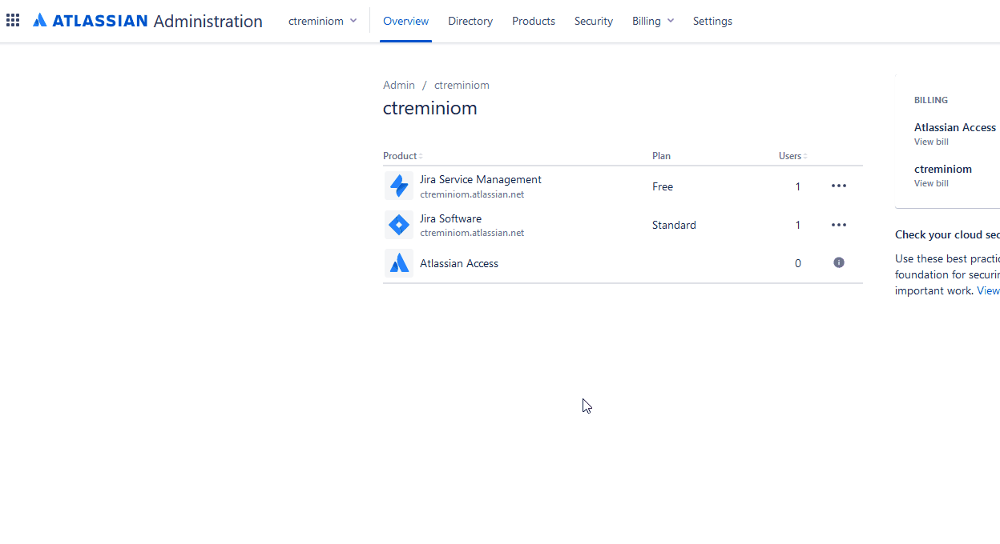
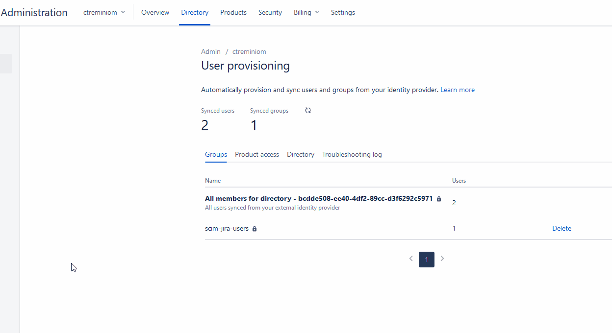

# 🧰 SCIM

 The [**user provisioning REST API**](https://developer.atlassian.com/cloud/admin/user-provisioning/rest/intro/) manages an integration between an external user directory and your Atlassian cloud products so you can automatically update the users and groups in your Atlassian organization when you make updates in your identity provider \(IdP\). For example, with user provisioning, you can create, link, and deactivate managed Atlassian user accounts from your IdP. We support user provisioning using the System for Cross-domain Identity Management \(SCIM\) protocol version 2.0

## Authentication and authorization

To manage users and groups with the user provisioning REST API, you need an API key separate from your **Cloud admin API key**. This key gives full administrative access to your organization's directory, allowing the API client to create and update user attributes and change user group membership. 

Once you have your API key, you can provide it as a bearer token in the `Authorization` part of your HTTPS header. If you need to "rotate" or regenerate an API key, use the following steps:

### Step 1

 Go to [**admin.atlassian.com**](https://admin.atlassian.com/) and click your organization.

### Step 2

Click **Directory**, then click **User provisioning**.

### Step 3

Click the **Directory** tab, then click the **Regenerate API key** button and click **Regenerate key**.


Copy the organization ID and the API key to a safe place. Once you close the API key information screen, we won't show you this information again.


## Limitations

### User limitations

* A user account only can only be created if it has an email address on a domain you have verified.
* Deleting a user account via the user provisioning API is not supported. The DELETE operation deactivates the user account, which is the same as setting the `active` flag to `false`.
* There is a 5000-user limit per directory. This limit is enforced for compatibility with products that have an upper bound for total supported users.

### Group limitations

* When you sync a group that has the same name as an existing group in the organization, the group sync fails with a 409 \(conflict\) error.
* If the API creates a group in the organization's directory that has the same name of a site's group \(e.g. confluence-users\), the API successfully creates the group in the directory but fails to propagate the group to the organization's sites. You'll see this event in the audit log.
* Changing group names isn't supported. Renaming groups after they've synced to your Atlassian organization isn't supported in this release of User Provisioning API. This is because some parts of the products rely on group names and changing the group name would result in users not being able to interact with the products correctly. To rename a group, create a new group with the desired name, update membership, and then delete the old group.

