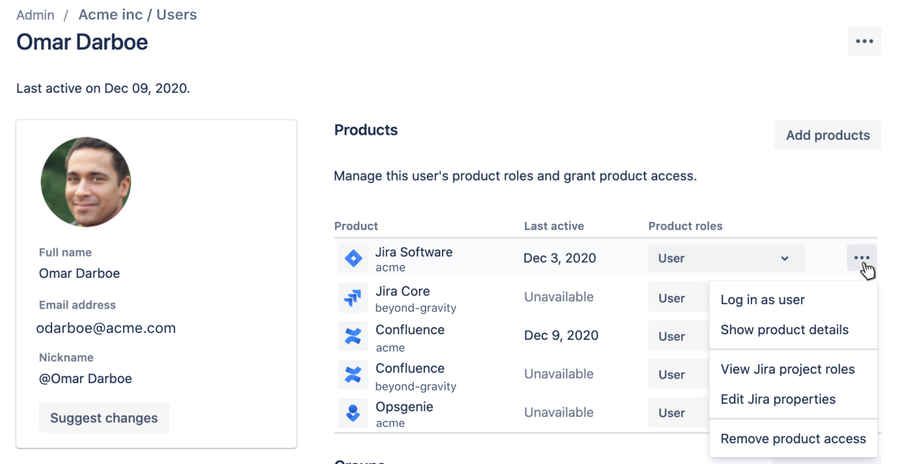

# 🗃 Add CustomField to Screen

In this article, I would be showing you how to add custom-fields on a Jira project screens using `go-atlassian.` Before we get started, let's first understand the Jira entities involved in this process: screens, screen tabs, and screen tab fields.

1. **Screens**:
   * Screens in Jira define the layout and configuration of different views, such as issue creation, editing, and viewing.
   * Each screen consists of one or more screen tabs.
2. **Screen Tabs:**
   * Screen tabs are sections within a screen that group related fields together.
   * A screen can have multiple screen tabs, and each tab can contain multiple fields.
3. **Screen Tab Fields:**
   * Screen tab fields are the individual fields (e.g., standard or custom fields) displayed within a screen tab.

## Step 1: Create a new Go project

Create a new directory for your project and navigate to it in your terminal or command prompt. Initialize a new Go module using the following command:

```bash
go mod init your-module-name
```

## Step 2: Install the "go-atlassian" library&#x20;

To use the "go-atlassian" library, you need to install it as a dependency in your project. Run the following command:

```bash
go get github.com/ctreminiom/go-atlassian
```

## Step 3: Import the required packages&#x20;

Create a new Go file, e.g., `main.go`, and import the necessary packages:

```go
package main

import (
	"fmt"
	"log"

	jira "github.com/ctreminiom/go-atlassian/jira/v2"
)
```

## Step 4: Set up Jira API client&#x20;

Initialize the Jira API client with your Jira base URL and API token:

```go
func main() {
	client, err := jira.New(nil, "https://your-jira-instance.atlassian.net")
	if err != nil {
		log.Fatal(err)
	}

	// Set API token for authentication
	client.Auth.SetBasicAuth(mail, token)
}
```

## Step 5: Extract the issue type screen scheme

Before to add the _customfields_ on the project screens, we need to search the issue type screen scheme associated with a Jira project, then iterates the mapping to extract the screen schemes linked. In this particular example, we're going to add the following customfields on the **KP** project:

* Start Date `customfield_10068`
* Sprint `customfield_10020`
* DueDate `duedate`
* timeTracking `timetracking`
* Environment `customfield_10069`
* Category `customfield_10070`
* Testing By `customfield_10071`

Use the following code to extract the issue type screen scheme linked to the KP project.

```go
var projectKey = "KP"

// --------------------------------------------------
// Extract the project ID using the Project.Get() method
// --------------------------------------------------
project, response, err := client.Project.Get(context.Background(), projectKey, nil)
if err != nil {
	if response != nil {
		log.Println("Response HTTP Response", response.Bytes.String())
		log.Println("Status HTTP Response", response.Status)
	}
	log.Fatal(err)
}

// --------------------------------------------------
// Transform the project id string to integer
// --------------------------------------------------
projectIDAsInt, err := strconv.Atoi(project.ID)
if err != nil {
	log.Fatal(err)
}

// --------------------------------------------------
// Extract the issue type screen scheme linked to the project selected
// --------------------------------------------------
projectMapping, response, err := client.Issue.Type.ScreenScheme.Projects(context.Background(), []int{projectIDAsInt}, 0, 50)
if err != nil {
	if response != nil {
		log.Println("Response HTTP Response", response.Bytes.String())
		log.Println("Status HTTP Response", response.Status)
	}
	log.Fatal(err)
}

// --------------------------------------------------
// Iterates the struts and extract the issue type screen scheme id
// --------------------------------------------------
var issueTypeScreenSchemeID string
for _, scheme := range projectMapping.Values {

	for _, projectID := range scheme.ProjectIds {

		if project.ID == projectID {
			issueTypeScreenSchemeID = projectID
		}
	}
}
```

## Step 6: Extract the screen schemes

With the Issue Type Screen Scheme ID extracted from the previous step, we can proceed with the screen scheme extraction, use the following code to extract the screen schemes

```go
// --------------------------------------------------
// Transform the project id string to integer
// --------------------------------------------------
issueTypeScreenSchemeIDAsInt, err := strconv.Atoi(issueTypeScreenSchemeID)
if err != nil {
	log.Fatal(err)
}

// --------------------------------------------------
// Extract the screen schemes linked to the issue type screen schemes
// --------------------------------------------------
schemeMapping, response, err := client.Issue.Type.ScreenScheme.Mapping(
	context.Background(),
	[]int{issueTypeScreenSchemeIDAsInt},
	0,
	50)

if err != nil {
	if response != nil {
		log.Println("Response HTTP Response", response.Bytes.String())
		log.Println("Status HTTP Response", response.Status)
	}
	log.Fatal(err)
}

// --------------------------------------------------
// Iterates the struts and extract the screen schemes ID as integers
// --------------------------------------------------
var screenSchemesIDs []int
for _, scheme := range schemeMapping.Values {

	screenSchemeIDAsInt, err := strconv.Atoi(scheme.ScreenSchemeID)
	if err != nil {
		log.Fatal(err)
	}

	screenSchemesIDs = append(screenSchemesIDs, screenSchemeIDAsInt)
}
```

## Step 7: Extract the screen IDs

The next step is extract the screen ID's from the screen schemes, you can use this code to extract the screen IDs.

```go
// --------------------------------------------------
// Extract the screens from the screen schemes IDs
// --------------------------------------------------
options := &models.ScreenSchemeParamsScheme{IDs: screenSchemesIDs}
screenSchemes, response, err := client.Screen.Scheme.Gets(context.Background(), options, 0, 50)
if err != nil {
	if response != nil {
		log.Println("Response HTTP Response", response.Bytes.String())
		log.Println("Status HTTP Response", response.Status)
	}
	log.Fatal(err)
}

// --------------------------------------------------
// Iterates the struts and screen IDs
// --------------------------------------------------
var screenIDs []int
for _, screenScheme := range screenSchemes.Values {

	if screenScheme.Screens != nil {
		screenIDs = append(screenIDs, screenScheme.Screens.Default)
		screenIDs = append(screenIDs, screenScheme.Screens.Create)
		screenIDs = append(screenIDs, screenScheme.Screens.Edit)
		screenIDs = append(screenIDs, screenScheme.Screens.View)
	}
}

// --------------------------------------------------
// Remove the duplicated values from the screenIDs slice
// I used the function "removeDuplicateInt" from the Stackoverflow question
// https://stackoverflow.com/questions/66643946/how-to-remove-duplicates-strings-or-int-from-slice-in-go
// --------------------------------------------------
screenIDsWithOutDuplicated := removeDuplicateInt(screenIDs)
```

## Step 8: Add the fields on the project screens

The final step is add the custom-fields on the screen default tabs, it's required to validate if the customfield is already added on the screen tab, if not, add the custom-field on the screen and log the result.

We can use the following code below:

```go
var customFieldsIDs = []string{
	"customfield_10068",
	"customfield_10020",
	"duedate",
	"timetracking",
	"customfield_10069",
	"customfield_10070",
	"customfield_10071",
}

// --------------------------------------------------
// Process each screen and do the following validations/logic
// 1. Extract the screen default tab
// 2. Using the default screen tab, extract the customfields stored on it
// 3. Check if the customfield is already added on the screen tab
// 4. If so, skip it
// 5. If not, append the customfield on the screen tab
// --------------------------------------------------

for _, screenID := range screenIDsWithOutDuplicated {

	// --------------------------------------------------
	// If you want to process the default screen, you can comment this if statement
	// --------------------------------------------------
	if screenID == 0 {
		continue
	}

	tabs, response, err := client.Screen.Tab.Gets(context.Background(), screenID, projectKey)
	if err != nil {
		if response != nil {
			log.Println("Response HTTP Response", response.Bytes.String())
			log.Println("Status HTTP Response", response.Status)
		}
		log.Fatal(err)
	}

	defaultTab := tabs[0].ID

	fields, response, err := client.Screen.Tab.Field.Gets(context.Background(), screenID, defaultTab)
	if err != nil {
		if response != nil {
			log.Println("Response HTTP Response", response.Bytes.String())
			log.Println("Status HTTP Response", response.Status)
		}
		log.Fatal(err)
	}

	// --------------------------------------------------
	// Iterate the fields slice and stores the fields already added on the screen tab
	// --------------------------------------------------
	var fieldsAlreadyAdded []string
	for _, field := range fields {
		fieldsAlreadyAdded = append(fieldsAlreadyAdded, field.ID)
	}

	// --------------------------------------------------
	// Check if the customfield requested is already added on the screen tab
	// --------------------------------------------------
	var fieldsAvailableToAdd []string
	for _, customFieldID := range customFieldsIDs {

		var isTaken bool
		for _, fieldsAdded := range fieldsAlreadyAdded {

			if customFieldID == fieldsAdded {
				isTaken = true
				break
			}
		}

		if !isTaken {
			fieldsAvailableToAdd = append(fieldsAvailableToAdd, customFieldID)
		}
	}

	// --------------------------------------------------
	// For each customfield filtered, add the field on the screen tab
	// --------------------------------------------------
	for _, fieldID := range fieldsAvailableToAdd {

		_, response, err = client.Screen.Tab.Field.Add(context.Background(), screenID, defaultTab, fieldID)
		if err != nil {
			if response != nil {
				log.Println("Response HTTP Response", response.Bytes.String())
				log.Println("Status HTTP Response", response.Status)
			}
			log.Fatal(err)
		}

		log.Println("The field", fieldID, "has been added on the screen ", screenID)
	}
```

When you run the code, the custom-fields selected will be available on the project :thumbsup::tada:.

<figure><figcaption></figcaption></figure>

<figure><figcaption></figcaption></figure>
