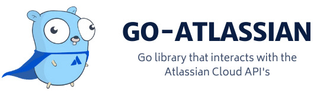

# ☘️ Introduction




 [](https://pkg.go.dev/github.com/ctreminiom/go-atlassian) [](https://goreportcard.com/report/github.com/ctreminiom/go-atlassian) [](https://app.fossa.com/projects/git%2Bgithub.com%2Fctreminiom%2Fgo-atlassian?ref=badge_shield) [](https://codecov.io/gh/ctreminiom/go-atlassian) [](https://www.codacy.com/gh/ctreminiom/go-atlassian/dashboard?utm_source=github.com&utm_medium=referral&utm_content=ctreminiom/go-atlassian&utm_campaign=Badge_Grade) [](https://github.com/ctreminiom/go-atlassian/blob/master/LICENSE) [](https://github.com/ctreminiom/go-atlassian/actions?query=workflow%3ATesting) [](https://docs.go-atlassian.io/)

go-atlassian is a Go module that enables the interaction with the Atlassian Cloud Services.

## ✨ Features

### 🛫 Jira Software Cloud

* CRUD Application Roles, Dashboards, Filters, Groups, Issues.
* Search Issues using the JQL query.
* Add attachments into JIRA issues, and transition issues.
* Creation of issue\(s\) using the instance custom\_fields.
* Edit issues using the operation's method **\(add,remove,replace\).**
* Assign issues and send custom mail notifications.
* CRUD the Issue Field Configuration, Issue Type Screen Scheme, and Permission Scheme.
* CRUD custom\_fields contexts and options.
* Link issues and create new issue link types.
* Get the issue priorities and resolutions.
* CRUD Screen Screens, Screens and Screen Tabs.
* CRUD issue votes and watchers.
* CRUD Jira Project\(s\), Project Categories, Project Components, Project Versions.
* CRUD Project Roles and add/remove project actors\(users\).
* Validate new Jira Project Name or Key.
* Add Jira Field into Screen.
* Get or Cancel Jira Async Task\(s\).
* CRUD Jira Users and Search users.

### 🛬 Jira Service Management Cloud

* CRUD JSM Customer\(s\).
* Search JSM Knowledgebase Articles.
* CRUD JSM Organizations and manipulates the Organization's Users.
* Get\(s\) and Answer Approval\(s\) and SLA\(s\).
* CRUD JSM Feedback\(s\) and Participant\(s\).
* Get\(s\) JSM Projects and Queues.
* CRUD JSM Request Types.

### 🛸 Atlassian Admin Cloud

* Get Organization\(s\), Verified Domain\(s\), Audit Log\(s\), and Event Actions.
* CRUD Organization Polities.
* Enable/Disable an Organization User.
* Get/Update Organization User.
* Get/Delete Organization User Token\(s\).
* Create/Deactivate/Get\(s\)/Update/Path SCIM User\(s\).
* Create/Get\(s\)/Update/Delete SCIM Group\(s\).
* Get SCIM Schema\(s\).

### 🛰️ Confluence Cloud

* In Development🔨

### 🚠 Jira Agile Cloud

* In Development🔨

## 🔰 Installation

Make sure you have Go installed \(download\). Version `1.13` or higher is required.

```text
## Jira Software Cloud / Service Management
$ go get -u -v github.com/ctreminiom/go-atlassian/jira/

## Atlassian Cloud Admin
$ go get -u -v github.com/ctreminiom/go-atlassian/admin/
```

## 📓 Documentation

Documentation is hosted live at [https://docs.go-atlassian.io/](https://docs.go-atlassian.io/)

## 📝 Usage

More examples in `jira/examples` `admin/examples` `jira/sm/examples` directories. Here's a short example of how to get a Jira Issue:

```text
package main

import (
	"context"
	"github.com/ctreminiom/go-atlassian/jira"
	"log"
	"os"
)

func main() {

	var (
		host  = os.Getenv("HOST")
		mail  = os.Getenv("MAIL")
		token = os.Getenv("TOKEN")
	)

	atlassian, err := jira.New(nil, host)
	if err != nil {
		return
	}

	atlassian.Auth.SetBasicAuth(mail, token)

	issue, response, err := atlassian.Issue.Get(context.Background(), "KP-12", nil, []string{"transitions"})
	if err != nil {
		if response != nil {
			log.Println("Response HTTP Response", string(response.BodyAsBytes))
			log.Println(response.StatusCode)
		}
		log.Fatal(err)
	}

	log.Println("Response HTTP Code", response.StatusCode)
	log.Println("HTTP Endpoint Used", response.Endpoint)

	log.Println(issue.Key)
	log.Println(issue.Fields.Reporter.AccountID)

	for _, transition := range issue.Transitions {
		log.Println(transition.Name, transition.ID, transition.To.ID, transition.HasScreen)
	}

}
```

## ⭐️ Project assistance

If you want to say **thank you** or/and support active development of `go-atlassian`:

* Add a [GitHub Star](https://github.com/ctreminiom/go-atlassian) to the project.
* Write interesting articles about project on [Dev.to](https://dev.to/), [Medium](https://medium.com/) or personal blog.
* Support the project by donating a cup of coffee.
* Contributions, issues and feature requests are welcome!
* Feel free to check [issues page](https://github.com/ctreminiom/go-atlassian/issues).

[](https://www.buymeacoffee.com/ctreminiom)

## 💡 Inspiration

The project was created with the purpose to provide a unique point to provide an interface for interacting with Atlassian products. This module is highly inspired by the Go library [https://github.com/andygrunwald/go-jira](https://github.com/andygrunwald/go-jira) but focused on Cloud solutions.

## 🧪 Run Test Cases

## 💳 Credits

In addition to all the contributors we would like to thank these vendors:

* **Atlassian** for developing such a powerful ecosystem.
* **Gitbook** for provided full features for open-source projects

## 📝 License

Copyright © 2021 [Carlos Treminio](https://github.com/ctreminiom). This project is [MIT](https://opensource.org/licenses/MIT) licensed.

[](https://app.fossa.com/projects/git%2Bgithub.com%2Fctreminiom%2Fgo-atlassian?ref=badge_large)

