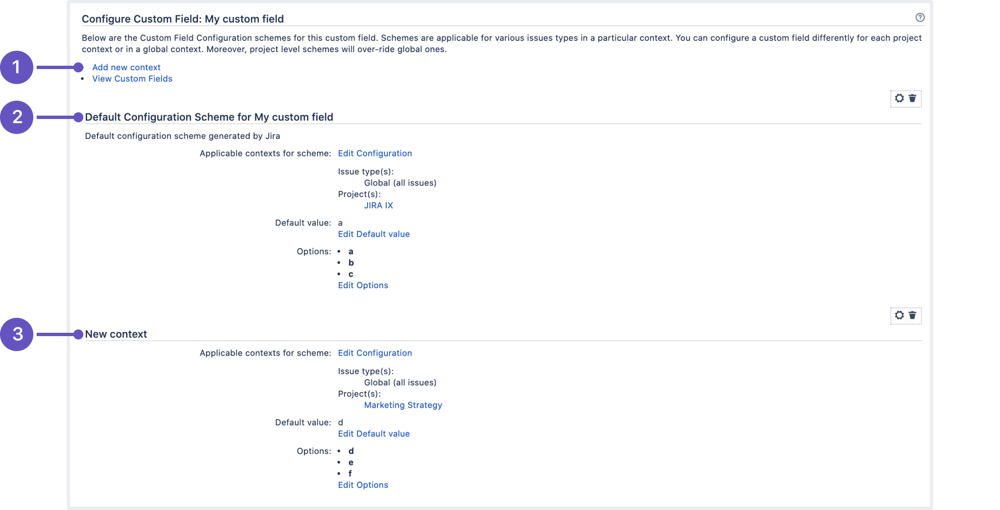

# 📬 Comments

Comments can range from simple text updates to let watchers know what's happening on the issue, to code snippets, images, tables, and more. The editor converts things like links, code, and markdown on-the-fly, so you can paste in your content and let the editor do the work.

.png>)

* **Mention your teammates:** If you need someone to know about a comment, you can mention them in it. Type @ followed by their name, then choose the right person from the list. The person you mention will be notified about your comment and can quickly jump to the issue to see what's happening.
* **Apply comment permissions:** If your comment is only meant for a specific Jira group or project role, comment permissions let you restrict your comments to the appropriate audience. When writing your comment, click the lock icon under it and choose a Jira group or project role to restrict it to.

.png>)

This resource represents issue comments. Use it to:

* get, create, update, and delete a comment from an issue.
* get all comments from issue.
* get a list of comments by comment ID.

## Get comments

Returns all comments for an issue.

```go
package main

import (
	"context"
	"github.com/ctreminiom/go-atlassian/jira/v2"
	"log"
	"os"
)

func main() {

	var (
		host  = os.Getenv("HOST")
		mail  = os.Getenv("MAIL")
		token = os.Getenv("TOKEN")
	)

	atlassian, err := v2.New(nil, host)
	if err != nil {
		return
	}

	atlassian.Auth.SetBasicAuth(mail, token)

	comments, response, err := atlassian.Issue.Comment.Gets(context.Background(), "KP-2", "", nil, 0, 50)
	if err != nil {
		log.Fatal(err)
	}

	log.Println("HTTP Endpoint Used", response.Endpoint)

	for _, comment := range comments.Comments {
		log.Println(comment.ID, comment.Created)
	}
}
```

## Get comment

Returns a comment.

```go
package main

import (
	"context"
	"github.com/ctreminiom/go-atlassian/jira/v2"
	"log"
	"os"
)

func main() {

	var (
		host  = os.Getenv("HOST")
		mail  = os.Getenv("MAIL")
		token = os.Getenv("TOKEN")
	)

	atlassian, err := v2.New(nil, host)
	if err != nil {
		return
	}

	atlassian.Auth.SetBasicAuth(mail, token)

	comment, response, err := atlassian.Issue.Comment.Get(context.Background(), "KP-2", "10011")
	if err != nil {
		log.Fatal(err)
	}

	log.Println(response.Endpoint)
	log.Println(comment.ID, comment.Created)
}
```

## Delete comment

Deletes a comment.

```go
package main

import (
	"context"
	"github.com/ctreminiom/go-atlassian/jira/v2"
	"log"
	"os"
)

func main() {

	var (
		host  = os.Getenv("HOST")
		mail  = os.Getenv("MAIL")
		token = os.Getenv("TOKEN")
	)

	atlassian, err := v2.New(nil, host)
	if err != nil {
		return
	}

	atlassian.Auth.SetBasicAuth(mail, token)

	response, err := atlassian.Issue.Comment.Delete(context.Background(), "KP-2", "10011")
	if err != nil {
		log.Fatal(err)
	}

	log.Println("HTTP Endpoint Used", response.Endpoint)
}
```

## Add comment

Adds a comment to an issue.

```go
package main

import (
	"context"
	"github.com/ctreminiom/go-atlassian/jira/v2"
	"github.com/ctreminiom/go-atlassian/pkg/infra/models"
	"log"
	"os"
)

func main() {

	var (
		host  = os.Getenv("HOST")
		mail  = os.Getenv("MAIL")
		token = os.Getenv("TOKEN")
	)

	atlassian, err := v2.New(nil, host)
	if err != nil {
		return
	}

	atlassian.Auth.SetBasicAuth(mail, token)
	atlassian.Auth.SetUserAgent("curl/7.54.0")

	payload := &models.CommentPayloadSchemeV2{
		Body:       "test",
	}

	newComment, response, err := atlassian.Issue.Comment.Add(context.Background(), "KP-2", payload, nil)
	if err != nil {
		log.Fatal(err)
	}

	log.Println("HTTP Endpoint Used", response.Endpoint)
	log.Println(newComment.ID)
}
```

## Atlassian Document Format <a href="#atlassian-document-format" id="atlassian-document-format"></a>

&#x20;The Atlassian Document Format (ADF) represents rich text stored in Atlassian products. For example, in Jira Cloud platform, the text in issue comments and in `textarea` custom fields is stored as ADF, here's a bundle of examples you can use in order to create custom body messages.


### Example 1



```go
	commentBody := jira.CommentNodeScheme{}
	commentBody.Version = 1
	commentBody.Type = "doc"
	
	
	//Append Header
	commentBody.AppendNode(&jira.CommentNodeScheme{
		Type:    "heading",
		Attrs: map[string]interface{}{"level": 1},

		Content: []*jira.CommentNodeScheme{
			{
				Type: "text",
				Text: "Header 1",
			},
		},
	})

	//Append Lorem text
	commentBody.AppendNode(&jira.CommentNodeScheme{
		Type: "paragraph",
		Content: []*jira.CommentNodeScheme{
			{
				Type: "text",
				Text: "Lorem ipsum dolor sit amet, consectetur adipiscing elit, sed do eiusmod tempor incididunt ut labore " +
					"et dolore magna aliqua. Ut enim ad minim veniam, quis nostrud exercitation ullamco laboris nisi ut aliquip " +
					"ex ea commodo consequat. Duis aute irure dolor in reprehenderit in voluptate velit esse cillum dolore " +
					"eu fugiat nulla pariatur. Excepteur sint occaecat cupidatat non proident, sunt in culpa qui " +
					"officia deserunt mollit anim id est laborum",
			},
		},
	})

	//Append Nested Panel Data
	commentBody.AppendNode(&jira.CommentNodeScheme{
		Type: "panel",
		Attrs: map[string]interface{}{"panelType":"note"},

		Content: []*jira.CommentNodeScheme{

			{
				Type: "paragraph",
				Content: []*jira.CommentNodeScheme{
					{
						Type: "text",
						Text: "Excepteur ",
						Marks: []*jira.MarkScheme{
							{Type: "textColor", Attrs: map[string]interface{}{"color":"#6554c0"}},
						},
					},

					{
						Type: "text",
						Text: "sint occaecat cupidatat non proident, sunt in culpa qui officia deserunt mollit anim id est laborum",
					},
				},


			},
		},

	})

	//Append Heading Title
	commentBody.AppendNode(&jira.CommentNodeScheme{
		Type: "heading",
		Attrs: map[string]interface{}{"level": 2},
		Content: []*jira.CommentNodeScheme{
			{
				Type: "text",
				Text: "Links",
			},
		},
	})

	//Append bulletList
	commentBody.AppendNode(&jira.CommentNodeScheme{
		Type: "bulletList",
		Content: []*jira.CommentNodeScheme{
			{
				Type: "listItem",
				Content: []*jira.CommentNodeScheme{
					{
						Type: "paragraph",
						Content: []*jira.CommentNodeScheme{
							{
								Type: "text",
								Text: "Google.com",
								Marks: []*jira.MarkScheme{
									{
										Type: "link",
										Attrs: map[string]interface{}{"href": "https://www.google.com/"},
									},
								},
							},
						},
					},
				},
			},

			{
				Type: "listItem",
				Content: []*jira.CommentNodeScheme{
					{
						Type: "paragraph",
						Content: []*jira.CommentNodeScheme{
							{
								Type: "text",
								Text: "Facebook.com",
								Marks: []*jira.MarkScheme{
									{
										Type: "link",
										Attrs: map[string]interface{}{"href": "https://www.facebook.com/"},
									},
								},
							},
						},
					},
				},
			},
		},
	})
```

### Example 2

.png>)

```go
	commentBody := jira.CommentNodeScheme{}
	commentBody.Version = 1
	commentBody.Type = "doc"

	//Create the Tables Headers
	tableHeaders := &jira.CommentNodeScheme{
		Type: "tableRow",
		Content: []*jira.CommentNodeScheme{

			{
				Type: "tableHeader",
				Content: []*jira.CommentNodeScheme{
					{
						Type: "paragraph",
						Content: []*jira.CommentNodeScheme{
							{
								Type: "text",
								Text: "Header 1",
								Marks: []*jira.MarkScheme{
									{
										Type: "strong",
									},
								},
							},
						},
					},

				},
			},

			{
				Type: "tableHeader",
				Content: []*jira.CommentNodeScheme{
					{
						Type: "paragraph",
						Content: []*jira.CommentNodeScheme{
							{
								Type: "text",
								Text: "Header 2",
								Marks: []*jira.MarkScheme{
									{
										Type: "strong",
									},
								},
							},
						},
					},

				},
			},

			{
				Type: "tableHeader",
				Content: []*jira.CommentNodeScheme{
					{
						Type: "paragraph",
						Content: []*jira.CommentNodeScheme{
							{
								Type: "text",
								Text: "Header 3",
								Marks: []*jira.MarkScheme{
									{
										Type: "strong",
									},
								},
							},
						},
					},

				},
			},

		},

	}

	row1 := &jira.CommentNodeScheme{
		Type: "tableRow",
		Content: []*jira.CommentNodeScheme{
			{
				Type: "tableCell",
				Content: []*jira.CommentNodeScheme{
					{
						Type: "paragraph",
						Content: []*jira.CommentNodeScheme{
							{Type: "text", Text: "Row 00"},
						},
					},
				},
			},

			{
				Type: "tableCell",
				Content: []*jira.CommentNodeScheme{
					{
						Type: "paragraph",
						Content: []*jira.CommentNodeScheme{
							{Type: "text", Text: "Row 01"},
						},
					},
				},
			},

			{
				Type: "tableCell",
				Content: []*jira.CommentNodeScheme{
					{
						Type: "paragraph",
						Content: []*jira.CommentNodeScheme{
							{Type: "text", Text: "Row 02"},
						},
					},
				},
			},

		},

	}

	row2 := &jira.CommentNodeScheme{
		Type: "tableRow",
		Content: []*jira.CommentNodeScheme{
			{
				Type: "tableCell",
				Content: []*jira.CommentNodeScheme{
					{
						Type: "paragraph",
						Content: []*jira.CommentNodeScheme{
							{Type: "text", Text: "Row 10"},
						},
					},
				},
			},

			{
				Type: "tableCell",
				Content: []*jira.CommentNodeScheme{
					{
						Type: "paragraph",
						Content: []*jira.CommentNodeScheme{
							{Type: "text", Text: "Row 11"},
						},
					},
				},
			},

			{
				Type: "tableCell",
				Content: []*jira.CommentNodeScheme{
					{
						Type: "paragraph",
						Content: []*jira.CommentNodeScheme{
							{Type: "text", Text: "Row 12"},
						},
					},
				},
			},

		},

	}

	commentBody.AppendNode(&jira.CommentNodeScheme{
		Type: "table",
		Attrs: map[string]interface{}{"isNumberColumnEnabled": false, "layout": "default"},
		Content: []*jira.CommentNodeScheme{tableHeaders, row1, row2},
	})
```

