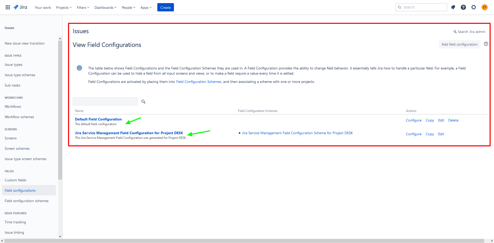

# 🎛️Configuration

As a Jira administrator, you can configure the default field configuration to make specific fields required or hidden based on the needs of your team. You can create additional field configurations to manage fields across multiple projects, issue types, and screens. A field configuration can be associated with an issue type within a field configuration scheme, which can then be associated with a project.





This resource represents issue field configurations. Use it to get, set, and delete field configurations and field configuration schemes.

## Get all field configurations

Returns a [paginated](https://developer.atlassian.com/cloud/jira/platform/rest/v3/intro/#pagination) list of all field configurations, the method returns the following information:

```go
package main

import (
	"context"
	"github.com/ctreminiom/go-atlassian/jira"
	"log"
	"os"
)

func main() {

	var (
		host  = os.Getenv("HOST")
		mail  = os.Getenv("MAIL")
		token = os.Getenv("TOKEN")
	)

	atlassian, err := jira.New(nil, host)
	if err != nil {
		return
	}

	atlassian.Auth.SetBasicAuth(mail, token)

	fieldConfigurations, response, err := atlassian.Issue.Field.Configuration.Gets(
		context.Background(),
		nil,
		false,
		0,
		50,
	)

	if err != nil {
		log.Fatal(err)
	}

	log.Println("HTTP Endpoint Used", response.Endpoint)

	for _, configuration := range fieldConfigurations.Values {
		log.Println(configuration)
	}

}
```


🧚‍♀️ **Tips: **You can extract the following struct tags


```go
type FieldConfigSearchScheme struct {
   MaxResults int                  `json:"maxResults,omitempty"`
   StartAt    int                  `json:"startAt,omitempty"`
   Total      int                  `json:"total,omitempty"`
   IsLast     bool                 `json:"isLast,omitempty"`
   Values     []*FieldConfigurationScheme `json:"values,omitempty"`
}

type FieldConfigScheme struct {
   ID          int    `json:"id,omitempty"`
   Name        string `json:"name,omitempty"`
   Description string `json:"description,omitempty"`
   IsDefault   bool   `json:"isDefault,omitempty"`
}
```

## Get field configuration items

Returns a [paginated](https://developer.atlassian.com/cloud/jira/platform/rest/v3/intro/#pagination) list of all fields for a configuration

* 🔒 **Permissions required**:  _Administer Jira_ [global permission](https://confluence.atlassian.com/x/x4dKLg)

```go
package main

import (
	"context"
	"github.com/ctreminiom/go-atlassian/jira"
	"log"
	"os"
)

func main() {

	var (
		host  = os.Getenv("HOST")
		mail  = os.Getenv("MAIL")
		token = os.Getenv("TOKEN")
	)

	atlassian, err := jira.New(nil, host)
	if err != nil {
		return
	}

	atlassian.Auth.SetBasicAuth(mail, token)

	items, response, err := atlassian.Issue.Field.Configuration.Items(context.Background(), 10000, 0, 50)
	if err != nil {
		log.Fatal(err)
	}

	log.Println("HTTP Endpoint Used", response.Endpoint)

	for _, item := range items.Values {
		log.Println(item)
	}

}
```


🧚‍♀️ **Tips: **You can extract the following struct tags


```go
type FieldConfigurationItemPageScheme struct {
	MaxResults int                             `json:"maxResults,omitempty"`
	StartAt    int                             `json:"startAt,omitempty"`
	Total      int                             `json:"total,omitempty"`
	IsLast     bool                            `json:"isLast,omitempty"`
	Values     []*FieldConfigurationItemScheme `json:"values,omitempty"`
}

type FieldConfigurationItemScheme struct {
	ID          string `json:"id,omitempty"`
	IsHidden    bool   `json:"isHidden,omitempty"`
	IsRequired  bool   `json:"isRequired,omitempty"`
	Description string `json:"description,omitempty"`
}
```

## Get all field configuration schemes

Returns a [paginated](https://developer.atlassian.com/cloud/jira/platform/rest/v3/intro/#pagination) list of field configuration schemes, the method returns the following information:


Only field configuration schemes used in classic projects are returned.


```go
package main

import (
	"context"
	"github.com/ctreminiom/go-atlassian/jira"
	"log"
	"os"
)

func main() {

	var (
		host  = os.Getenv("HOST")
		mail  = os.Getenv("MAIL")
		token = os.Getenv("TOKEN")
	)

	atlassian, err := jira.New(nil, host)
	if err != nil {
		return
	}

	atlassian.Auth.SetBasicAuth(mail, token)

	fieldConfigurationSchemes, response, err := atlassian.Issue.Field.Configuration.Schemes(context.Background(), nil, 0, 50)
	if err != nil {
		log.Fatal(err)
	}

	log.Println("HTTP Endpoint Used", response.Endpoint)

	for _, fieldConfigurationScheme := range fieldConfigurationSchemes.Values {
		log.Println(fieldConfigurationScheme)
	}

}
```


🧚‍♀️ **Tips: **You can extract the following struct tags


```go
type FieldConfigurationSchemePageScheme struct {
	MaxResults int                               `json:"maxResults,omitempty"`
	StartAt    int                               `json:"startAt,omitempty"`
	Total      int                               `json:"total,omitempty"`
	IsLast     bool                              `json:"isLast,omitempty"`
	Values     []*FieldConfigurationSchemeScheme `json:"values,omitempty"`
}

type FieldConfigurationSchemeScheme struct {
	ID          string `json:"id,omitempty"`
	Name        string `json:"name,omitempty"`
	Description string `json:"description,omitempty"`
}
```

## Get field configuration issue type items

Returns a [paginated](https://developer.atlassian.com/cloud/jira/platform/rest/v3/intro/#pagination) list of field configuration issue type items, the method returns the following information:

```go
package main

import (
	"context"
	"github.com/ctreminiom/go-atlassian/jira"
	"log"
	"os"
)

func main() {

	var (
		host  = os.Getenv("HOST")
		mail  = os.Getenv("MAIL")
		token = os.Getenv("TOKEN")
	)

	atlassian, err := jira.New(nil, host)
	if err != nil {
		return
	}

	atlassian.Auth.SetBasicAuth(mail, token)

	configurationIssueTypeItems, response, err := atlassian.Issue.Field.Configuration.IssueTypeItems(context.Background(), nil, 0, 50)
	if err != nil {
		log.Fatal(err)
	}

	log.Println("HTTP Endpoint Used", response.Endpoint)

	for _, issueTypeItem := range configurationIssueTypeItems.Values {
		log.Println(issueTypeItem)
	}

}
```


🧚‍♀️ **Tips: **You can extract the following struct tags


```go
type FieldConfigurationIssueTypeItemPageScheme struct {
   MaxResults int                                      `json:"maxResults,omitempty"`
   StartAt    int                                      `json:"startAt,omitempty"`
   Total      int                                      `json:"total,omitempty"`
   IsLast     bool                                     `json:"isLast,omitempty"`
   Values     []*FieldConfigurationIssueTypeItemScheme `json:"values,omitempty"`
}

type FieldConfigurationIssueTypeItemScheme struct {
   FieldConfigurationSchemeID string `json:"fieldConfigurationSchemeId,omitempty"`
   IssueTypeID                string `json:"issueTypeId,omitempty"`
   FieldConfigurationID       string `json:"fieldConfigurationId,omitempty"`
}
```

## Get field configuration schemes for projects

Returns a [paginated](https://developer.atlassian.com/cloud/jira/platform/rest/v3/intro/#pagination) list of field configuration schemes and, for each scheme, a list of the projects that use it. The list is sorted by field configuration scheme ID. The first item contains the list of project IDs assigned to the default field configuration scheme, the method returns the following information:

```go
package main

import (
	"context"
	"github.com/ctreminiom/go-atlassian/jira"
	"log"
	"os"
)

func main() {

	var (
		host  = os.Getenv("HOST")
		mail  = os.Getenv("MAIL")
		token = os.Getenv("TOKEN")
	)

	atlassian, err := jira.New(nil, host)
	if err != nil {
		return
	}

	atlassian.Auth.SetBasicAuth(mail, token)

	schemes, response, err := atlassian.Issue.Field.Configuration.SchemesByProject(context.Background(), []int{10001, 10000}, 0, 50)
	if err != nil {
		log.Fatal(err)
	}

	log.Println("HTTP Endpoint Used", response.Endpoint)

	for _, scheme := range schemes.Values {
		log.Println(scheme)
	}

}
```


🧚‍♀️ **Tips: **You can extract the following struct tags


```go
type FieldConfigurationSchemeProjectPageScheme struct {
   MaxResults int                                      `json:"maxResults,omitempty"`
   StartAt    int                                      `json:"startAt,omitempty"`
   Total      int                                      `json:"total,omitempty"`
   IsLast     bool                                     `json:"isLast,omitempty"`
   Values     []*FieldConfigurationSchemeProjectScheme `json:"values,omitempty"`
}

type FieldConfigurationSchemeProjectScheme struct {
   ProjectIds               []string                        `json:"projectIds,omitempty"`
   FieldConfigurationScheme *FieldConfigurationSchemeScheme `json:"fieldConfigurationScheme,omitempty"`
}
```
