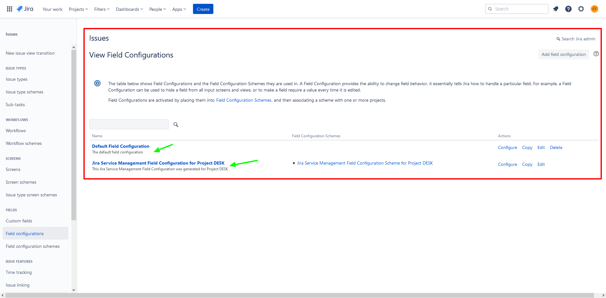

# 🖼 Configuration

As a Jira administrator, you can configure the default field configuration to make specific fields required or hidden based on the needs of your team. You can create additional field configurations to manage fields across multiple projects, issue types, and screens. A field configuration can be associated with an issue type within a field configuration scheme, which can then be associated with a project.




## Get all Field Configurations

Returns a [paginated](https://developer.atlassian.com/cloud/jira/platform/rest/v3/intro/#pagination) list of field configurations. The list can be for all field configurations or a subset determined by any combination of these criteria:

* a list of field configuration item IDs.
* whether the field configuration is a default.
* whether the field configuration name or description contains a query string.


Only field configurations used in company-managed (classic) projects are returned


```go
package main

import (
	"context"
	"github.com/ctreminiom/go-atlassian/jira/v2"
	"log"
	"os"
)

func main() {

	var (
		host  = os.Getenv("HOST")
		mail  = os.Getenv("MAIL")
		token = os.Getenv("TOKEN")
	)

	atlassian, err := v2.New(nil, host)
	if err != nil {
		return
	}

	atlassian.Auth.SetBasicAuth(mail, token)

	fieldConfigurations, response, err := atlassian.Issue.Field.Configuration.Gets(
		context.Background(),
		nil,
		false,
		0,
		50,
	)

	if err != nil {
		log.Fatal(err)
	}

	log.Println("HTTP Endpoint Used", response.Endpoint)

	for _, configuration := range fieldConfigurations.Values {
		log.Println(configuration)
	}

}
```

## Create Field Configuration

Creates a field configuration. The field configuration is created with the same field properties as the default configuration, with all the fields being optional.


Only field configurations used in company-managed (classic) projects are returned


```go
package main

import (
	"context"
	"fmt"
	"github.com/ctreminiom/go-atlassian/jira/v2"
	"log"
	"os"
)

func main()  {

	var (
		host  = os.Getenv("HOST")
		mail  = os.Getenv("MAIL")
		token = os.Getenv("TOKEN")
	)

	atlassian, err := v2.New(nil, host)
	if err != nil {
		return
	}

	atlassian.Auth.SetBasicAuth(mail, token)

	newFieldConfiguration, response, err := atlassian.Issue.Field.Configuration.Create(
		context.Background(),
		"Story DUMMY Field Configuration",
		"description sample")
	if err != nil {
		log.Fatal(err)
	}

	log.Println("HTTP Endpoint Used", response.Endpoint)

	fmt.Println(newFieldConfiguration.ID)
	fmt.Println(newFieldConfiguration.Name)
	fmt.Println(newFieldConfiguration.Description)
	fmt.Println(newFieldConfiguration.IsDefault)
}
```

## Update Field Configuration

Updates a field configuration. The name and the description provided in the request override the existing values.


Only field configurations used in company-managed (classic) projects are returned


```go
package main

import (
	"context"
	"github.com/ctreminiom/go-atlassian/jira/v2"
	"log"
	"os"
)

func main()  {

	var (
		host  = os.Getenv("HOST")
		mail  = os.Getenv("MAIL")
		token = os.Getenv("TOKEN")
	)

	atlassian, err := v2.New(nil, host)
	if err != nil {
		return
	}

	atlassian.Auth.SetBasicAuth(mail, token)

	response, err := atlassian.Issue.Field.Configuration.Update(context.Background(), 10002, "name updated", "")
	if err != nil {
		log.Fatal(err)
	}

	log.Println("HTTP Endpoint Used", response.Endpoint)
}


```

## Delete Field Configuration

Deletes a field configuration.


Only field configurations used in company-managed (classic) projects are returned


```go
package main

import (
	"context"
	"github.com/ctreminiom/go-atlassian/jira/v2"
	"log"
	"os"
)

func main()  {

	var (
		host  = os.Getenv("HOST")
		mail  = os.Getenv("MAIL")
		token = os.Getenv("TOKEN")
	)

	atlassian, err := v2.New(nil, host)
	if err != nil {
		return
	}

	atlassian.Auth.SetBasicAuth(mail, token)

	response, err := atlassian.Issue.Field.Configuration.Delete(context.Background(), 10002)
	if err != nil {
		log.Fatal(err)
	}

	log.Println("HTTP Endpoint Used", response.Endpoint)
}
```
