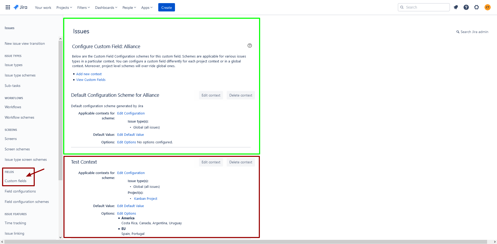

# 🍳 Context

When you create a custom field as a Jira administrator, you automatically create what's called a custom field context or custom field configuration scheme.&#x20;

This lets you select a custom field language and default value, as well as which issue types or projects the custom field appears in. If you're looking to simply edit the name or description of a custom field, or if you need to delete a custom field



This resource represents issue custom field contexts. Use it to:

* get, create, update, and delete custom field contexts.
* get context to issue types and project mappings.
* get custom field contexts for projects and issue types.
* assign custom field contexts to projects.
* remove custom field contexts from projects.
* add issue types to custom field contexts.

## Get custom field contexts

&#x20;Returns a [paginated](https://developer.atlassian.com/cloud/jira/platform/rest/v3/intro/#pagination) list of [contexts](https://confluence.atlassian.com/adminjiracloud/what-are-custom-field-contexts-991923859.html)

&#x20;for a custom field. Contexts can be returned as follows:

* With no other parameters set, all contexts.
* By defining `id` only, all contexts from the list of IDs.
* By defining `isAnyIssueType`, limit the list of contexts returned to either those that apply to all issue types (true) or those that apply to only a subset of issue types (false)
* By defining `isGlobalContext`, limit the list of contexts return to either those that apply to all projects (global contexts) (true) or those that apply to only a subset of projects (false)

```go
package main

import (
	"context"
	"github.com/ctreminiom/go-atlassian/jira"
	"log"
	"os"
)

func main() {

	var (
		host  = os.Getenv("HOST")
		mail  = os.Getenv("MAIL")
		token = os.Getenv("TOKEN")
	)

	atlassian, err := jira.New(nil, host)
	if err != nil {
		return
	}

	atlassian.Auth.SetBasicAuth(mail, token)

	var fieldID = "customfield_10038"

	options := jira.FieldContextOptionsScheme{
		IsAnyIssueType:  false,
		IsGlobalContext: false,
		ContextID:       nil,
	}

	contexts, response, err := atlassian.Issue.Field.Context.Gets(context.Background(), fieldID, &options, 0, 50)
	if err != nil {
		log.Fatal(err)
	}

	log.Println("HTTP Endpoint Used", response.Endpoint)

	log.Println(contexts)

	for _, fieldContext := range contexts.Values {
		log.Println(fieldContext)
	}

}
```


🧚‍♀️ **Tips: **You can extract the following struct tags


```go
type CustomFieldContextPageScheme struct {
	MaxResults int                  `json:"maxResults,omitempty"`
	StartAt    int                  `json:"startAt,omitempty"`
	Total      int                  `json:"total,omitempty"`
	IsLast     bool                 `json:"isLast,omitempty"`
	Values     []*FieldContextScheme `json:"values,omitempty"`
}

type FieldContextScheme struct {
	ID              string `json:"id,omitempty"`
	Name            string `json:"name,omitempty"`
	Description     string `json:"description,omitempty"`
	IsGlobalContext bool   `json:"isGlobalContext,omitempty"`
	IsAnyIssueType  bool   `json:"isAnyIssueType,omitempty"`
	ProjectIds   []string `json:"projectIds,omitempty"`
	IssueTypeIds []string `json:"issueTypeIds,omitempty"`
}
```

## Create custom field context

Creates a custom field context. If `projectIds` is empty, a global context is created. A global context is one that applies to all project. If `issueTypeIds` is empty, the context applies to all issue types, the method returns the following information:

```go
package main

import (
	"context"
	"github.com/ctreminiom/go-atlassian/jira"
	"log"
	"os"
)

func main() {

	var (
		host  = os.Getenv("HOST")
		mail  = os.Getenv("MAIL")
		token = os.Getenv("TOKEN")
	)

	atlassian, err := jira.New(nil, host)
	if err != nil {
		return
	}

	atlassian.Auth.SetBasicAuth(mail, token)

	var fieldID = "customfield_10038"

	payload := jira.FieldContextPayloadScheme{
		IssueTypeIDs: []int{10004},
		ProjectIDs:   []int{10002},
		Name:         "Bug fields context $3 aaw",
		Description:  "A context used to define the custom field options for bugs.",
	}

	contextCreated, response, err := atlassian.Issue.Field.Context.Create(context.Background(), fieldID, &payload)
	if err != nil {
		log.Fatal(err)
		return
	}

	log.Println("HTTP Endpoint Used", response.Endpoint)
	log.Println(contextCreated)

}
```


🧚‍♀️ **Tips: **You can extract the following struct tags


```go
type FieldContextScheme struct {
   ID              string `json:"id,omitempty"`
   Name            string `json:"name,omitempty"`
   Description     string `json:"description,omitempty"`
   IsGlobalContext bool   `json:"isGlobalContext,omitempty"`
   IsAnyIssueType  bool   `json:"isAnyIssueType,omitempty"`
   ProjectIds   []string `json:"projectIds,omitempty"`
   IssueTypeIds []string `json:"issueTypeIds,omitempty"`
}
```

## Get custom field contexts default values

&#x20;Returns a [paginated](https://developer.atlassian.com/cloud/jira/platform/rest/v3/intro/#pagination) list of defaults for a custom field. The results can be filtered by `contextId`, otherwise all values are returned. If no defaults are set for a context, nothing is returned.

```go
package main

import (
	"context"
	"github.com/ctreminiom/go-atlassian/jira"
	"log"
	"os"
)

func main() {

	var (
		host  = os.Getenv("HOST")
		mail  = os.Getenv("MAIL")
		token = os.Getenv("TOKEN")
	)

	atlassian, err := jira.New(nil, host)
	if err != nil {
		return
	}

	atlassian.Auth.SetBasicAuth(mail, token)
	var fieldID = "customfield_10038"

	defaultValues, response, err := atlassian.Issue.Field.Context.GetDefaultValues(context.Background(), fieldID, nil, 0, 50)
	if err != nil {
		return
	}

	log.Println("HTTP Endpoint Used", response.Endpoint)

	for _, value := range defaultValues.Values {

		/*
			For singleOption customField type, use value.OptionID
			For multipleOption customField type, use value.OptionIDs
			For cascadingOption customField type, use value.OptionID and value.CascadingOptionID
		*/
		log.Println(value)
	}

}
```


🧚‍♀️ **Tips: **You can extract the following struct tags


```go
type CustomFieldDefaultValuePageScheme struct {
	MaxResults int                              `json:"maxResults,omitempty"`
	StartAt    int                              `json:"startAt,omitempty"`
	Total      int                              `json:"total,omitempty"`
	IsLast     bool                             `json:"isLast,omitempty"`
	Values     []*CustomFieldDefaultValueScheme `json:"values,omitempty"`
}

type CustomFieldDefaultValueScheme struct {
	ContextID         string   `json:"contextId,omitempty"`
	OptionID          string   `json:"optionId,omitempty"`
	CascadingOptionID string   `json:"cascadingOptionId,omitempty"`
	OptionIDs         []string `json:"optionIds,omitempty"`
	Type              string   `json:"type,omitempty"`
}
```

## Set custom field contexts default values

Sets default for contexts of a custom field. Default is defined using these objects:

| Name                                                                     | Type                                        | Description                                                     |
| ------------------------------------------------------------------------ | ------------------------------------------- | --------------------------------------------------------------- |
| <p></p><p><code>CustomFieldContextDefaultValueSingleOption</code></p>    | <p></p><p><code>option.single</code></p>    | <p></p><p>For single choice select lists and radio buttons.</p> |
| <p></p><p><code>CustomFieldContextDefaultValueMultipleOption</code></p>  | <p></p><p><code>option.multiple</code></p>  | <p></p><p>For multiple-choice select lists and checkboxes.</p>  |
| <p></p><p><code>CustomFieldContextDefaultValueCascadingOption</code></p> | <p></p><p><code>option.cascading</code></p> | <p></p><p>For cascading select lists.</p>                       |


Only one type of default object can be included in a request. To remove a default for a context, set the default parameter to `null`.


```go
package main

import (
	"context"
	"github.com/ctreminiom/go-atlassian/jira"
	"log"
	"os"
)

func main() {

	var (
		host  = os.Getenv("HOST")
		mail  = os.Getenv("MAIL")
		token = os.Getenv("TOKEN")
	)

	atlassian, err := jira.New(nil, host)
	if err != nil {
		return
	}

	atlassian.Auth.SetBasicAuth(mail, token)

	var fieldID = "customfield_10038"

	var payload = &jira.FieldContextDefaultPayloadScheme{
		DefaultValues: []*jira.CustomFieldDefaultValueScheme{
			{
				ContextID: "10138",
				OptionID:  "10022",
				Type:      "option.single",
			},
		},
	}

	response, err := atlassian.Issue.Field.Context.SetDefaultValue(context.Background(), fieldID, payload)
	if err != nil {
		log.Fatal(err)
	}

	log.Println("HTTP Endpoint Used", response.Endpoint)
}
```

## Update custom field context

&#x20;Updates a [custom field context](https://confluence.atlassian.com/adminjiracloud/what-are-custom-field-contexts-991923859.html).

```go
package main

import (
	"context"
	"github.com/ctreminiom/go-atlassian/jira"
	"log"
	"os"
)

func main() {

	var (
		host  = os.Getenv("HOST")
		mail  = os.Getenv("MAIL")
		token = os.Getenv("TOKEN")
	)

	atlassian, err := jira.New(nil, host)
	if err != nil {
		return
	}

	atlassian.Auth.SetBasicAuth(mail, token)

	var (
		customFieldID  = "customfield_10038"
		contextID      = 10140
		newName        = "New Context Name"
		newDescription = "New Context Description"
	)

	response, err := atlassian.Issue.Field.Context.Update(context.Background(), customFieldID, contextID, newName, newDescription)
	if err != nil {
		log.Fatal(err)
	}

	log.Println("HTTP Endpoint Used", response.Endpoint)
}
```

## Delete custom field context

&#x20;Deletes a [custom field context](https://confluence.atlassian.com/adminjiracloud/what-are-custom-field-contexts-991923859.html).

```go
package main

import (
	"context"
	"github.com/ctreminiom/go-atlassian/jira"
	"log"
	"os"
)

func main() {

	var (
		host  = os.Getenv("HOST")
		mail  = os.Getenv("MAIL")
		token = os.Getenv("TOKEN")
	)

	atlassian, err := jira.New(nil, host)
	if err != nil {
		return
	}

	atlassian.Auth.SetBasicAuth(mail, token)

	var (
		customFieldID = "customfield_10038"
		contextID     = 10140
	)

	response, err := atlassian.Issue.Field.Context.Delete(context.Background(), customFieldID, contextID)
	if err != nil {
		log.Fatal(err)
		return
	}

	log.Println("HTTP Endpoint Used", response.Endpoint)
}
```

## Add issue types to context

Adds issue types to a custom field context, appending the issue types to the issue types list.

```go
package main

import (
	"context"
	"github.com/ctreminiom/go-atlassian/jira"
	"log"
	"os"
)

func main() {

	var (
		host  = os.Getenv("HOST")
		mail  = os.Getenv("MAIL")
		token = os.Getenv("TOKEN")
	)

	atlassian, err := jira.New(nil, host)
	if err != nil {
		return
	}

	atlassian.Auth.SetBasicAuth(mail, token)

	var (
		customFieldID = "customfield_10038"
		contextID     = 10180
		issueTypesIDs = []string{"10007", "10002"}
	)

	response, err := atlassian.Issue.Field.Context.AddIssueTypes(context.Background(), customFieldID, contextID, issueTypesIDs)
	if err != nil {
		log.Fatal(err)
		return
	}

	log.Println("HTTP Endpoint Used", response.Endpoint)
}
```

## Remove issue types from context

Removes issue types from a custom field context.

```go
package main

import (
	"context"
	"github.com/ctreminiom/go-atlassian/jira"
	"log"
	"os"
)

func main() {

	var (
		host  = os.Getenv("HOST")
		mail  = os.Getenv("MAIL")
		token = os.Getenv("TOKEN")
	)

	atlassian, err := jira.New(nil, host)
	if err != nil {
		return
	}

	atlassian.Auth.SetBasicAuth(mail, token)

	var (
		customFieldID = "customfield_10038"
		contextID     = 10180
		issueTypesIDs = []string{"10007", "10002"}
	)

	response, err := atlassian.Issue.Field.Context.RemoveIssueTypes(context.Background(), customFieldID, contextID, issueTypesIDs)
	if err != nil {
		return
	}

	log.Println("HTTP Endpoint Used", response.Endpoint)
}
```

## Assign custom field context to projects

Assigns a custom field context to projects.

```go
package main

import (
	"context"
	"github.com/ctreminiom/go-atlassian/jira"
	"log"
	"os"
)

func main() {

	var (
		host  = os.Getenv("HOST")
		mail  = os.Getenv("MAIL")
		token = os.Getenv("TOKEN")
	)

	atlassian, err := jira.New(nil, host)
	if err != nil {
		return
	}

	atlassian.Auth.SetBasicAuth(mail, token)

	var (
		customFieldID = "customfield_10038"
		contextID     = 10179
		projectIDs    = []string{"10003"}
	)

	response, err := atlassian.Issue.Field.Context.Link(context.Background(), customFieldID, contextID, projectIDs)
	if err != nil {
		log.Fatal(err)
	}

	log.Println("HTTP Endpoint Used", response.Endpoint)
}
```

## Remove custom field context from projects

Removes a custom field context from projects.

```go
package main

import (
	"context"
	"github.com/ctreminiom/go-atlassian/jira"
	"log"
	"os"
)

func main() {

	var (
		host  = os.Getenv("HOST")
		mail  = os.Getenv("MAIL")
		token = os.Getenv("TOKEN")
	)

	atlassian, err := jira.New(nil, host)
	if err != nil {
		return
	}

	atlassian.Auth.SetBasicAuth(mail, token)

	var (
		customFieldID = "customfield_10038"
		contextID     = 10179
		projectIDs    = []string{"10003"}
	)

	response, err := atlassian.Issue.Field.Context.UnLink(context.Background(), customFieldID, contextID, projectIDs)
	if err != nil {
		log.Fatal(err)
	}

	log.Println("HTTP Endpoint Used", response.Endpoint)
}

```

## Get project mappings for custom field context

&#x20;Returns a [paginated](https://developer.atlassian.com/cloud/jira/platform/rest/v3/intro/#pagination) list of context to project mappings for a custom field. The result can be filtered by `contextId`. Otherwise, all mappings are returned. Invalid IDs are ignored.

```go
package main

import (
	"context"
	"github.com/ctreminiom/go-atlassian/jira"
	"log"
	"os"
)

func main() {

	var (
		host  = os.Getenv("HOST")
		mail  = os.Getenv("MAIL")
		token = os.Getenv("TOKEN")
	)

	atlassian, err := jira.New(nil, host)
	if err != nil {
		return
	}

	atlassian.Auth.SetBasicAuth(mail, token)

	var fieldID = "customfield_10038"

	mapping, response, err := atlassian.Issue.Field.Context.ProjectsContext(context.Background(), fieldID, nil, 0, 50)
	if err != nil {
		log.Fatal(err)
	}

	log.Println("HTTP Endpoint Used", response.Endpoint)
	log.Println(mapping.Total)

}
```
