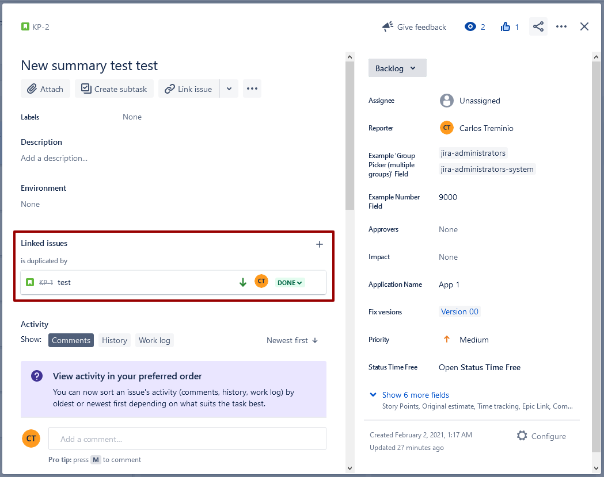

# 🔗 Link

You can link issues to keep track of duplicate or related work. You can, for example:&#x20;

* create a new linked issue from an existing issue in a service project or business project
* create an association between an issue and a Confluence page
* link an issue to any other web page

Make sure you have the _link issues _project permission before getting started. Note that your Jira administrator can customize the types of links that you can create.




This resource represents links between issues. Use it to get, create, and delete links between issues.To use this resource, the site must have issue linking enabled.


## Create issue link

&#x20;Creates a link between two issues. Use this operation to indicate a relationship between two issues and optionally add a comment to the from (outward) issue, the method returns the following information:


If the link request duplicates a link, the response indicates that the issue link was created. If the request included a comment, the comment is added.


```go
package main

import (
	"context"
	"github.com/ctreminiom/go-atlassian/jira"
	"log"
	"os"
)

func main() {

	var (
		host  = os.Getenv("HOST")
		mail  = os.Getenv("MAIL")
		token = os.Getenv("TOKEN")
	)

	atlassian, err := jira.New(nil, host)
	if err != nil {
		log.Fatal(err)
	}

	atlassian.Auth.SetBasicAuth(mail, token)

	payload := &jira.LinkPayloadScheme{

		Comment: &jira.CommentPayloadScheme{

			Body: &jira.CommentNodeScheme{
				Version: 1,
				Type:    "doc",
				Content: []*jira.CommentNodeScheme{
					{
						Type: "paragraph",
						Content: []*jira.CommentNodeScheme{
							{
								Type: "text",
								Text: "Carlos Test",
							},
							{
								Type: "emoji",
								Attrs: map[string]interface{}{
									"shortName": ":grin",
									"id":        "1f601",
									"text":      "😁",
								},
							},
							{
								Type: "text",
								Text: " ",
							},
						},
					},
				},
			},
		},

		InwardIssue: &jira.LinkedIssueScheme{
			Key: "KP-1",
		},
		OutwardIssue: &jira.LinkedIssueScheme{
			Key: "KP-2",
		},
		Type: &jira.LinkTypeScheme{
			Name: "Duplicate",
		},
	}

	response, err := atlassian.Issue.Link.Create(context.Background(), payload)
	if err != nil {
		log.Fatal(err)
	}

	log.Println("HTTP Endpoint Used", response.Endpoint)
}
```

## Get issue links

Return the issue links associated with a Jira Issue, the method returns the following information:

```go
package main

import (
	"context"
	"github.com/ctreminiom/go-atlassian/jira"
	"log"
	"os"
)

func main() {

	var (
		host  = os.Getenv("HOST")
		mail  = os.Getenv("MAIL")
		token = os.Getenv("TOKEN")
	)

	atlassian, err := jira.New(nil, host)
	if err != nil {
		log.Fatal(err)
	}

	atlassian.Auth.SetBasicAuth(mail, token)

	issueLinks, response, err := atlassian.Issue.Link.Gets(context.Background(), "KP-1")
	if err != nil {
		log.Fatal(err)
	}

	log.Println("HTTP Endpoint Used", response.Endpoint)

	for _, link := range issueLinks.Fields.IssueLinks {
		log.Println(link)
	}

}
```


🧚‍♀️ **Tips: **You can extract the following struct tags


```go
type IssueLinkPageScheme struct {
	Expand string `json:"expand,omitempty"`
	ID     string `json:"id,omitempty"`
	Self   string `json:"self,omitempty"`
	Key    string `json:"key,omitempty"`
	Fields struct {
		IssueLinks []*IssueLinkScheme `json:"issuelinks,omitempty"`
	} `json:"fields,omitempty"`
}

type IssueLinkScheme struct {
	ID           string             `json:"id,omitempty"`
	Type         *LinkTypeScheme    `json:"type,omitempty"`
	InwardIssue  *LinkedIssueScheme `json:"inwardIssue,omitempty"`
	OutwardIssue *LinkedIssueScheme `json:"outwardIssue,omitempty"`
}

type LinkTypeScheme struct {
	Self    string `json:"self,omitempty"`
	ID      string `json:"id,omitempty"`
	Name    string `json:"name,omitempty"`
	Inward  string `json:"inward,omitempty"`
	Outward string `json:"outward,omitempty"`
}

type LinkedIssueScheme struct {
	ID     string             `json:"id,omitempty"`
	Key    string             `json:"key,omitempty"`
	Self   string             `json:"self,omitempty"`
	Fields *IssueFieldsScheme `json:"fields,omitempty"`
}
```

## Get issue link

Returns an issue link, the method returns the following information:

```go
package main

import (
	"context"
	"github.com/ctreminiom/go-atlassian/jira"
	"log"
	"os"
)

func main() {

	var (
		host  = os.Getenv("HOST")
		mail  = os.Getenv("MAIL")
		token = os.Getenv("TOKEN")
	)

	atlassian, err := jira.New(nil, host)
	if err != nil {
		log.Fatal(err)
	}

	atlassian.Auth.SetBasicAuth(mail, token)

	issueLink, response, err := atlassian.Issue.Link.Get(context.Background(), "10002")
	if err != nil {
		log.Fatal(err)
	}

	log.Println("HTTP Endpoint Used", response.Endpoint)

	log.Println(issueLink.ID)
	log.Println("----------------")
	log.Println(issueLink.Type.Name)
	log.Println(issueLink.Type.ID)
	log.Println(issueLink.Type.Self)
	log.Println(issueLink.Type.Inward)
	log.Println(issueLink.Type.Outward)
	log.Println("----------------")
	log.Println(issueLink.InwardIssue)
	log.Println(issueLink.OutwardIssue)
}


```


🧚‍♀️ **Tips: **You can extract the following struct tags


```go
type IssueLinkScheme struct {
	ID           string             `json:"id,omitempty"`
	Type         *LinkTypeScheme    `json:"type,omitempty"`
	InwardIssue  *LinkedIssueScheme `json:"inwardIssue,omitempty"`
	OutwardIssue *LinkedIssueScheme `json:"outwardIssue,omitempty"`
}

type LinkTypeScheme struct {
	Self    string `json:"self,omitempty"`
	ID      string `json:"id,omitempty"`
	Name    string `json:"name,omitempty"`
	Inward  string `json:"inward,omitempty"`
	Outward string `json:"outward,omitempty"`
}

type LinkedIssueScheme struct {
	ID     string             `json:"id,omitempty"`
	Key    string             `json:"key,omitempty"`
	Self   string             `json:"self,omitempty"`
	Fields *IssueFieldsScheme `json:"fields,omitempty"`
}	
```

## Delete issue link

Deletes an issue link, the method returns the following information:

```go
package main

import (
	"context"
	"github.com/ctreminiom/go-atlassian/jira"
	"log"
	"os"
)

func main() {

	var (
		host  = os.Getenv("HOST")
		mail  = os.Getenv("MAIL")
		token = os.Getenv("TOKEN")
	)

	atlassian, err := jira.New(nil, host)
	if err != nil {
		log.Fatal(err)
	}

	atlassian.Auth.SetBasicAuth(mail, token)

	response, err := atlassian.Issue.Link.Delete(context.Background(), "10002")
	if err != nil {
		log.Fatal(err)
	}

	log.Println("HTTP Endpoint Used", response.Endpoint)

}
```
