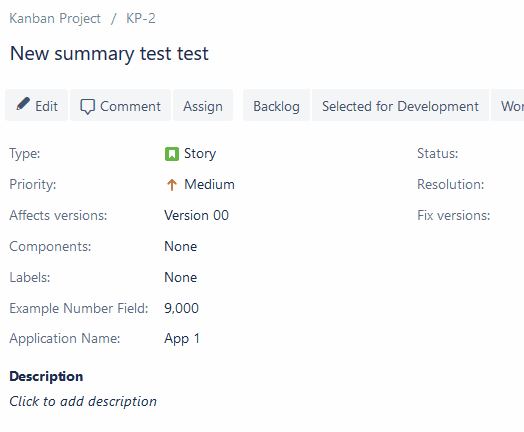

# 📦 Type

Just as a project can have many different types of work, Jira uses different issue types to help identify, categorize, and report on your team’s work. We’ll cover Jira’s standard-issue types below.



## Get all issue types for user

Returns all issue types.

```go
package main

import (
	"context"
	"github.com/ctreminiom/go-atlassian/jira/v2"
	"log"
	"os"
)

func main() {

	/*
		----------- Set an environment variable in git bash -----------
		export HOST="https://ctreminiom.atlassian.net/"
		export MAIL="MAIL_ADDRESS"
		export TOKEN="TOKEN_API"

		Docs: https://stackoverflow.com/questions/34169721/set-an-environment-variable-in-git-bash
	*/

	var (
		host  = os.Getenv("HOST")
		mail  = os.Getenv("MAIL")
		token = os.Getenv("TOKEN")
	)

	atlassian, err := v2.New(nil, host)
	if err != nil {
		log.Fatal(err)
	}

	atlassian.Auth.SetBasicAuth(mail, token)

	types, response, err := atlassian.Issue.Type.Gets(context.Background())
	if err != nil {
		log.Fatal(err)
	}

	log.Println("HTTP Endpoint Used", response.Endpoint)

	for _, value := range types {
		log.Println(value.ID, value.Name, value.Subtask, value.Scope)
	}
}
```

## Create issue type

Creates an issue type and adds it to the default issue type scheme.

```go
package main

import (
	"context"
	"github.com/ctreminiom/go-atlassian/jira/v2"
	"github.com/ctreminiom/go-atlassian/pkg/infra/models"
	"log"
	"os"
)

func main() {

	/*
		----------- Set an environment variable in git bash -----------
		export HOST="https://ctreminiom.atlassian.net/"
		export MAIL="MAIL_ADDRESS"
		export TOKEN="TOKEN_API"

		Docs: https://stackoverflow.com/questions/34169721/set-an-environment-variable-in-git-bash
	*/

	var (
		host  = os.Getenv("HOST")
		mail  = os.Getenv("MAIL")
		token = os.Getenv("TOKEN")
	)

	atlassian, err := v2.New(nil, host)
	if err != nil {
		log.Fatal(err)
	}

	atlassian.Auth.SetBasicAuth(mail, token)

	issueTypePayload := models.IssueTypePayloadScheme{
		Name:        "Risk",
		Description: "this is the issue type description",
		Type:        "standard",
	}

	issueType, response, err := atlassian.Issue.Type.Create(context.Background(), &issueTypePayload)
	if err != nil {
		log.Fatal(err)
	}

	log.Println("HTTP Endpoint Used", response.Endpoint)
	log.Println(issueType.Name)
}
```

## Get issue type

Returns an issue type.

```go
package main

import (
	"context"
	"github.com/ctreminiom/go-atlassian/jira/v2"
	"log"
	"os"
)

func main() {

	/*
		----------- Set an environment variable in git bash -----------
		export HOST="https://ctreminiom.atlassian.net/"
		export MAIL="MAIL_ADDRESS"
		export TOKEN="TOKEN_API"

		Docs: https://stackoverflow.com/questions/34169721/set-an-environment-variable-in-git-bash
	*/

	var (
		host  = os.Getenv("HOST")
		mail  = os.Getenv("MAIL")
		token = os.Getenv("TOKEN")
	)

	atlassian, err := v2.New(nil, host)
	if err != nil {
		log.Fatal(err)
	}

	atlassian.Auth.SetBasicAuth(mail, token)

	issueType, response, err := atlassian.Issue.Type.Get(context.Background(), "10000")

	if err != nil {
		log.Fatal(err)
	}

	log.Println("HTTP Endpoint Used", response.Endpoint)
	log.Println(issueType.Name)
}
```

## Update issue type

Updates the issue type.

```go
package main

import (
	"context"
	"github.com/ctreminiom/go-atlassian/jira/v2"
	"github.com/ctreminiom/go-atlassian/pkg/infra/models"
	"log"
	"os"
)

func main() {

	/*
		----------- Set an environment variable in git bash -----------
		export HOST="https://ctreminiom.atlassian.net/"
		export MAIL="MAIL_ADDRESS"
		export TOKEN="TOKEN_API"

		Docs: https://stackoverflow.com/questions/34169721/set-an-environment-variable-in-git-bash
	*/

	var (
		host  = os.Getenv("HOST")
		mail  = os.Getenv("MAIL")
		token = os.Getenv("TOKEN")
	)

	atlassian, err := v2.New(nil, host)
	if err != nil {
		log.Fatal(err)
	}

	atlassian.Auth.SetBasicAuth(mail, token)

	issueTypePayload := models.IssueTypePayloadScheme{
		Name:        "Risk UPDATED",
		Description: "this is the issue type description, UPDATED",
	}

	issueType, response, err := atlassian.Issue.Type.Update(context.Background(), "id", &issueTypePayload)
	if err != nil {
		log.Fatal(err)
	}

	log.Println("HTTP Endpoint Used", response.Endpoint)
	log.Println(issueType.Name)
}
```

## Delete issue type

Deletes the issue type. If the issue type is in use, all uses are updated with the alternative issue type (`alternativeIssueTypeId`).&#x20;

```go
package main

import (
	"context"
	"github.com/ctreminiom/go-atlassian/jira/v2"
	"log"
	"os"
)

func main() {

	/*
		----------- Set an environment variable in git bash -----------
		export HOST="https://ctreminiom.atlassian.net/"
		export MAIL="MAIL_ADDRESS"
		export TOKEN="TOKEN_API"

		Docs: https://stackoverflow.com/questions/34169721/set-an-environment-variable-in-git-bash
	*/

	var (
		host  = os.Getenv("HOST")
		mail  = os.Getenv("MAIL")
		token = os.Getenv("TOKEN")
	)

	atlassian, err := v2.New(nil, host)
	if err != nil {
		log.Fatal(err)
	}

	atlassian.Auth.SetBasicAuth(mail, token)

	response, err := atlassian.Issue.Type.Delete(context.Background(), "id")
	if err != nil {
		log.Fatal(err)
	}

	log.Println("HTTP Endpoint Used", response.Endpoint)
}
```

## Get alternative issue types

Returns a list of issue types that can be used to replace the issue type. The alternative issue types are those assigned to the same workflow scheme, field configuration scheme, and screen scheme.

```go
package main

import (
	"context"
	"github.com/ctreminiom/go-atlassian/jira/v2"
	"log"
	"os"
)

func main() {

	/*
		----------- Set an environment variable in git bash -----------
		export HOST="https://ctreminiom.atlassian.net/"
		export MAIL="MAIL_ADDRESS"
		export TOKEN="TOKEN_API"

		Docs: https://stackoverflow.com/questions/34169721/set-an-environment-variable-in-git-bash
	*/

	var (
		host  = os.Getenv("HOST")
		mail  = os.Getenv("MAIL")
		token = os.Getenv("TOKEN")
	)

	atlassian, err := v2.New(nil, host)
	if err != nil {
		log.Fatal(err)
	}

	atlassian.Auth.SetBasicAuth(mail, token)

	issueTypes, response, err := atlassian.Issue.Type.Alternatives(context.Background(), "")
	if err != nil {
		log.Fatal(err)
	}

	log.Println("HTTP Endpoint Used", response.Endpoint)

	for _, issueType := range issueTypes {
		log.Println(issueType)
	}
}
```
